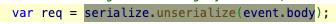
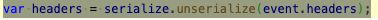
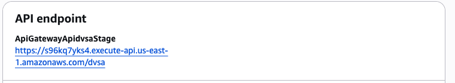
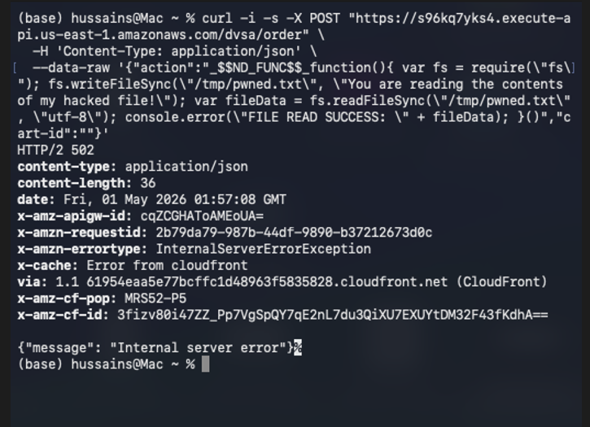
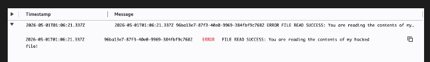
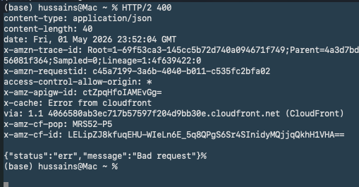
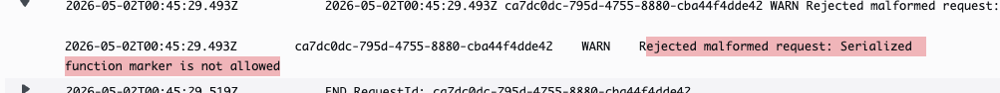
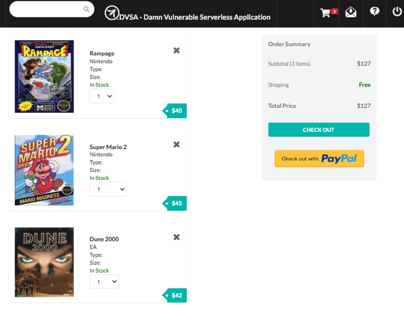
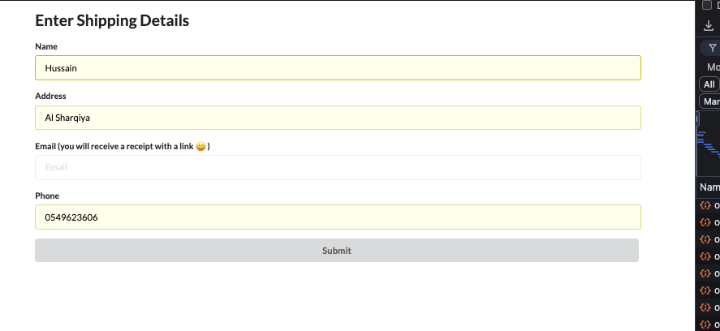
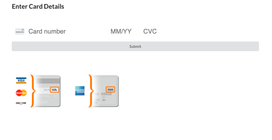

# Lesson #1: Event Injection

| Course / Term | ICS344: Information Security / Term 252 |
| --- | --- |
| Student Name(s) + ID(s) | Hussain Albaggal |
| DVSA Website URL | http://dvsa-website-986263532904-us-east-1.s3-website-us-east-1.amazonaws.com/ |
| AWS Region | us-east-1 (United States, N. Virginia) |
| API Endpoint Used | https://s96kq7yks4.execute-api.us-east-1.amazonaws.com/dvsa/order |
| Lambda Function | DVSA-ORDER-MANAGER |
| CloudWatch Log Group | /aws/lambda/DVSA-ORDER-MANAGER |

## Part 1) Goal and Vulnerability Summary

Lesson #1 demonstrates an Event Injection vulnerability that results in remote code execution through unsafe deserialization in the DVSA serverless backend. The affected workflow is the /dvsa/order API path, which is exposed through Amazon API Gateway and handled by the DVSA-ORDER-MANAGER AWS Lambda function. The security impact is severe because attacker-controlled request data can be interpreted as executable JavaScript inside the Lambda runtime instead of being handled only as plain JSON data. At a high level, the weakness is that the backend request-processing logic trusts and unserializes user-controlled input using a dangerous serialization library rather than safely parsing and validating JSON fields.

## Part 2) Why This Works / Root Cause

The vulnerability happens because the DVSA-ORDER-MANAGER Lambda function uses unsafe deserialization on data that comes directly from the API request. In the vulnerable code, the request body and headers are parsed using node-serialize / serialize.unserialize() instead of normal safe JSON parsing. This is risky because node-serialize supports special function markers such as _$$ND_FUNC$$_, which can turn part of the request into executable JavaScript code.

In the exploit, the request included an immediately invoked function inside the serialized value. When the backend tried to unserialize the request, the function executed before the rest of the handler completed. This means the application treated external user input as code instead of just data, which breaks a basic security rule for API handling.

That is why the payload was able to run inside the Lambda environment and print the FILE READ SUCCESS message in CloudWatch. Even though the API response later showed an internal server error, the important point is that the injected code had already executed during parsing. This confirms that the root cause is unsafe deserialization of attacker-controlled input.

// Vulnerable pattern to screenshot before fixing const serialize = require('node-serialize');

var req = serialize.unserialize(event.body); var headers = serialize.unserialize(event.headers);

## Part 3) Environment and Setup

The test was done in the DVSA AWS lab environment for the ICS344 project, not on any real production system. For Lesson 1, the DVSA deployment was used was used in the us-east-1 region, which is United States, N. Virginia. The API base endpoint shown in the AWS application page was:

https://s96kq7yks4.execute-api.us-east-1.amazonaws.com/dvsa

For the actual Lesson 1 test, The test used the /order route, so the full endpoint was:

https://s96kq7yks4.execute-api.us-east-1.amazonaws.com/dvsa/order

The main affected backend component was the DVSA-ORDER-MANAGER Lambda function. This function receives the order API request and processes the request body before routing the action to other backend Lambda functions. The CloudWatch log group /aws/lambda/DVSA-ORDER-MANAGER was used to confirm whether the injected code executed.

The tools used in this lesson were the AWS Console, Lambda Console, API Gateway/Lambda application view, CloudWatch Logs, macOS Terminal, and curl. No real AWS keys, passwords, JWT tokens, session cookies, or private secrets are included in the report

_Figure L1-1 shows the DVSA API endpoint deployed in us-east-1. The Lesson 1 /order path was added to this base endpoint when sending the test request._

## Part 4) Reproduction Steps

Open the AWS Console and confirm the selected region is United States (N. Virginia) / us-east-1.

Open the DVSA application resources and identify the API endpoint: https://s96kq7yks4.execute-api.us-east-1.amazonaws.com/dvsa.

Append /order to create the Lesson 1 target endpoint: https://s96kq7yks4.execute-api.us-east-1.amazonaws.com/dvsa/order.

Open a terminal and send a crafted POST request to the /dvsa/order API endpoint using curl.

Observe that the client receives HTTP 502 / Internal server error. This is expected in this lesson because the proof-of-concept request does not include a valid authorization header, and the application crashes after the injected code has already executed.

Open CloudWatch Logs and search the /aws/lambda/DVSA-ORDER-MANAGER log group for FILE READ SUCCESS.

Confirm that CloudWatch contains the injected log message, proving backend code execution.

Command used:

curl -i -s -X POST "https://s96kq7yks4.execute-api.us-east-1.amazonaws.com/dvsa/order" \ -H 'Content-Type: application/json' \ -data-raw '{"action":"_$$ND_FUNC$$_function(){ var fs = require(\fs\); fs.writeFileSync(\/tmp/pwned.txt\, \You are reading the contents of my hacked file!\); var fileData = fs.readFileSync(\/tmp/pwned.txt\, \utf-8\); console.error(\FILE READ SUCCESS: \ + fileData); }()","cart-id":""}'

## Part 5) Evidence and Proof

The vulnerability is proven by combining the terminal output with the backend CloudWatch log. The terminal response showed HTTP 502 / Internal server error, but the CloudWatch log for DVSA-ORDER-MANAGER showed the injected FILE READ SUCCESS message. This means the malicious JavaScript executed inside the Lambda function before the backend failed later in the normal processing path.

_Figure L1-2: Terminal output showing the crafted Event Injection payload sent to the /dvsa/order endpoint. The API returned HTTP 502 / Internal server error._

_Figure L1-3: CloudWatch Logs showing FILE READ SUCCESS, proving that the injected JavaScript executed inside DVSA-ORDER-MANAGER._

Key proof line:

FILE READ SUCCESS: You are reading the contents of my hacked file!

## Part 6) Fix Strategy / Probable Mitigation

The fix belongs in the backend Lambda request-processing logic, specifically in DVSA-ORDER-MANAGER/order-manager.js. The mitigation is to remove unsafe deserialization from the request path, stop using node-serialize for attacker-controlled body or header data, parse request input with JSON.parse, reject serialized function markers, and validate request fields before any business logic runs. This addresses the root cause because the backend no longer gives user-controlled data a chance to become executable JavaScript. The fix should also avoid exposing detailed backend errors to the client; detailed diagnostic information should remain only in CloudWatch logs.

Remove the node-serialize import from order-manager.js.

Replace serialize.unserialize(event.body) with safe JSON parsing and validation.

Treat event.headers as a normal object or JSON object; do not unserialize it.

Reject payloads containing _$$ND_FUNC$$_ or $$ND_FUNC$$.

Validate that action is a string and is one of the expected order workflow actions.

Return a controlled 400 Bad request for malformed input and 401 Unauthorized when the authorization header is missing.

## Part 7) Code / Config Changes

Changed component:

Lambda function: DVSA-ORDER-MANAGER.

Source file path in the DVSA repository: backend/functions/order-manager/order-manager.js.

Removed logic: unsafe node-serialize request parsing.

Added logic: safe JSON parsing, serialized-function marker rejection, action validation, and safe error responses.

Before fix - vulnerable pattern:

const serialize = require('node-serialize');

var req = serialize.unserialize(event.body); var headers = serialize.unserialize(event.headers);

After fix - (recommended replacement code):

function makeResponse(statusCode, bodyObj) { return { statusCode: statusCode, headers: { "Access-Control-Allow-Origin": "*", "Content-Type": "application/json" }, body: JSON.stringify(bodyObj) }; }

function parseJsonObject(value, fieldName) { let parsed = value;

if (typeof value === "string") { parsed = JSON.parse(value); }

if (!parsed || Array.isArray(parsed) || typeof parsed !== "object") { throw new Error(fieldName + " must be a JSON object"); }

return parsed; }

function rejectSerializedFunctionMarkers(obj) { const raw = JSON.stringify(obj);

if (raw.includes("_$$ND_FUNC$$_") || raw.includes("$$ND_FUNC$$")) { throw new Error("Serialized function marker is not allowed"); } }

const ALLOWED_ACTIONS = new Set([ "new", "update", "cancel", "get", "orders", "account", "profile", "shipping", "billing", "complete", "inbox", "message", "delete", "upload", "feedback", "admin-orders" ]);

function validateRequest(req) { if (typeof req.action !== "string" || !ALLOWED_ACTIONS.has(req.action)) { throw new Error("Invalid action"); } }

var req; var headers;

try { req = parseJsonObject(event.body, "body"); headers = parseJsonObject(event.headers || {}, "headers");

rejectSerializedFunctionMarkers(req); rejectSerializedFunctionMarkers(headers); validateRequest(req); } catch (e) { console.warn("Rejected malformed request:", e.message); callback(null, makeResponse(400, { status: "err", message: "Bad request" })); return; }

var auth_header = headers.Authorization || headers.authorization;

if (!auth_header || typeof auth_header !== "string") { callback(null, makeResponse(401, { status: "err", message: "Unauthorized" })); return; }

## Part 8) Verification After Fix

After deploying the patched Lambda function, the same malicious curl request must be repeated. The expected secure result is that the request is rejected before any injected function executes. A good post-fix response is HTTP 400 with {"status":"err","message":"Bad request"}, or another controlled rejection that does not execute the payload. Then CloudWatch must be checked again to confirm that no new FILE READ SUCCESS line appears after the post-fix test timestamp.

After deploying the patched DVSA-ORDER-MANAGER Lambda function, the exact same malicious Event Injection payload was repeated. The request no longer returned HTTP 502. Instead, the backend safely rejected it with HTTP/2 400 and the response body: {"status":"err","message":"Bad request"}

This confirms that the malicious serialized-function payload was rejected before execution. CloudWatch Logs were then checked and confirmed that no new FILE READ SUCCESS entry appeared after the post-fix test timestamp. Old FILE READ SUCCESS entries from the pre-fix exploit may still remain in CloudWatch, but no new one was generated after the fix.

Post-fix verification command:

curl -i -s -X POST "https://s96kq7yks4.execute-api.us-east-1.amazonaws.com/dvsa/order" \ -H 'Content-Type: application/json' \ -data-raw '{"action":"_$$ND_FUNC$$_function(){ var fs = require(\fs\); fs.writeFileSync(\/tmp/pwned.txt\, \You are reading the contents of my hacked file!\); var fileData = fs.readFileSync(\/tmp/pwned.txt\, \utf-8\); console.error(\FILE READ SUCCESS: \ + fileData); }()","cart-id":""}'

_Figure L1-4: CloudWatch post-fix logs for DVSA-ORDER-MANAGER. The malicious request was rejected after the fix, and no new FILE READ SUCCESS entry appeared after the post-fix timestamp._

_Figure L1-5: Normal DVSA order/cart workflow still worked after the Lesson 1 fix, confirming that the mitigation did not break legitimate application behavior._

## Part 9) Structured Operation and Security Analysis

### 9.1 Intended Logic and Security Rule(s)

Under normal conditions, a user interacts with the DVSA frontend and submits an order-related request. The browser sends an HTTP request to Amazon API Gateway at the /dvsa/order endpoint. API Gateway invokes the DVSA-ORDER-MANAGER Lambda function. The Lambda function should parse the request as JSON data, read the Authorization header, validate the requested action, and route only legitimate order workflow operations to the correct backend function or data service. The correct output is an application response for the authenticated user, not execution of arbitrary code contained in request fields.

Rule 1: Request body and headers must be treated as untrusted data.

Rule 2: The backend must parse user input as data only, not as executable JavaScript.

Rule 3: The order manager must accept only expected action values and reject malformed requests.

Rule 4: A failed or unauthenticated request must fail safely without executing attacker-supplied code.

Rule 5: Detailed diagnostics belong in CloudWatch, while client-facing errors should remain generic.

### 9.2 Evidence Sources and Behavior Trace

| Case | Input / Action | Observed Behavior | Evidence |
| --- | --- | --- | --- |
| Normal intended behavior | Legitimate authenticated /dvsa/order request from the DVSA frontend. | Order manager parses JSON, validates the request, and routes the action without executing request fields as code. | Normal DVSA order/cart workflow still worked after the fix. The application continued to process legitimate order/cart requests without executing request fields as code. See Figure L1-5. |
| Exploit behavior | Crafted _$$ND_FUNC$$_function(){...}() payload sent to /dvsa/order with curl. | Injected JavaScript executed inside Lambda and wrote/read /tmp/pwned.txt before the API returned HTTP 502. | Terminal screenshot and CloudWatch FILE READ SUCCESS screenshot. |
| Post-fix behavior | Same crafted payload sent after replacing unsafe deserialization. | Request is rejected before execution; no new FILE READ SUCCESS entry appears in CloudWatch. | Post-fix curl output showed HTTP 400 Bad request, and CloudWatch showed no new FILE READ SUCCESS entry after the post-fix timestamp. See Figure L1-4. |

### 9.3 Deviation Analysis and Classification

The exploit is a security deviation because the action field in the API request was not handled as normal text/data. Instead, it was parsed in a way that allowed it to become executable JavaScript inside the Lambda function. The intended rule is that any value coming from the user, especially from an API request, must stay as data and must never be executed by the backend.

The proof is the CloudWatch log showing FILE READ SUCCESS. This message could not appear unless the injected function actually ran inside the DVSA-ORDER-MANAGER Lambda environment. So even though the API response showed an internal server error, the backend had already executed the malicious payload.

This case is classified as Intentional misuse / security-relevant abuse because the attacker deliberately sends a malformed node-serialize function payload using _$$ND_FUNC$$_ to trigger unauthorized code execution.

### 9.4 Explainable Fix and Post-Fix Validation

The wrong assumption was that data coming from the API request could be safely reconstructed using node-serialize. Since this data is controlled by the user, it should never be passed into a parser that can rebuild or execute functions. The fix should be applied inside the request-parsing logic of the DVSA-ORDER-MANAGER Lambda function.

To fix the issue, node-serialize was removed from the request path and the serialize.unserialize() calls were replaced with safe JSON parsing. Additional checks were added to reject serialized function markers such as _$$ND_FUNC$$_, validate that the action value is one of the expected actions, and return a clear controlled error when the request is invalid. This makes the backend treat the request as data only, not as code.

After the fix, the same malicious payload no longer created a new FILE READ SUCCESS entry in CloudWatch. At the same time, the normal DVSA order/cart workflow still worked. These two checks prove that the vulnerability was blocked without breaking legitimate application behavior.

## Table A - Structured Analysis Summary

| Vulnerability | Intended Rule(s) | Artifacts Used to Infer Rule | Normal Behavior Evidence | Exploit Behavior Evidence |
| --- | --- | --- | --- | --- |
| Lesson #1: Event Injection | Request body and headers must be parsed as data only. The backend must not execute user-controlled request fields, and only valid order workflow actions should be accepted. | DVSA API endpoint, DVSA-ORDER-MANAGER Lambda code, curl request, API response, CloudWatch Logs, and DVSA frontend order/cart workflow. | Normal DVSA order/cart workflow still worked after the fix, confirming that safe JSON parsing and marker rejection did not break legitimate behavior. See Figure L1-5. | The crafted _$$ND_FUNC$$_ payload returned HTTP 502 at the client but produced FILE READ SUCCESS in CloudWatch, proving backend JavaScript execution. |

## Table B - Structured Analysis Summary

| Vulnerability | Why This Is a Deviation | Deviation Class | Fix Applied (Where) | Post-Fix Verification | Optional Latency Before / After Logging |
| --- | --- | --- | --- | --- | --- |
| Lesson #1: Event Injection | The backend executed attacker-controlled request content during deserialization, violating the rule that external API input must be treated as data only. | Intentional misuse / security-relevant abuse | DVSA-ORDER-MANAGER/order-manager.js: removed node-serialize request parsing, used safe JSON parsing, rejected serialized function markers, validated action values, and returned controlled errors. | The same malicious payload returned HTTP 400 Bad request. CloudWatch showed no new FILE READ SUCCESS entry after the post-fix timestamp, and normal DVSA order/cart behavior still worked. | N/A |

## Part 10) Takeaway / Lessons Learned

This lesson shows that unsafe deserialization can turn a normal API request into backend code execution. In a serverless architecture, this is especially dangerous because injected code executes inside a managed Lambda environment that may have temporary file access, environment variables, CloudWatch logging, and AWS service permissions through the function execution role. The main secure design lesson is that user-controlled input must be treated as untrusted data, parsed using safe formats such as JSON, validated against strict expectations, and never passed into libraries or logic that can evaluate or reconstruct executable functions.

## Appendix A - Sources Used

ICS344 Project Description PDF: required 10-part structure, evidence, fix, verification, structured tables, and grading rules.

ICS344 Helper Guide PDF: Lesson 1 Event Injection reproduction flow, expected Internal server error behavior, and CloudWatch FILE READ SUCCESS proof.

OWASP DVSA project and official repository path: https://github.com/OWASP/DVSA.git

OWASP deserialization guidance: unsafe deserialization of untrusted data can lead to code execution and should be replaced with safe data parsing and validation.
