# Lesson #2: Broken Authentication

| Lesson summary: The application failed to properly validate JWT tokens. By manipulating the token, an attacker could access resources belonging to other users, resulting in unauthorized access. |
| --- |

Main affected component: Cognito authentication, JWT validation logic, API Gateway/Lambda authorization

## Part 1) Goal and Vulnerability Summary

This vulnerability is Broken Authentication in the DVSA application. It affects the JWT authentication system used by the API Gateway and Lambda functions.

The system trusts the content of the JWT without properly verifying its integrity. As a result, an attacker can modify the token and impersonate another user.

The impact is serious because it allows unauthorized access to other users' data, such as viewing their orders.

## Part 2) Why This Works / Root Cause

The vulnerability exists because the backend does not properly verify the JWT signature.

Instead of validating the token cryptographically, the system simply decodes the token, reads the username field, and uses it directly without any verification.

This means: Any attacker can modify the payload and change the username.

## Part 3) Environment and Setup

The DVSA application is deployed on AWS using API Gateway and Lambda functions. The API endpoint used is https://3zb40wtoy7.execute-api.us-east-1.amazonaws.com/dvsa/order. The main Lambda function involved is DVSA-ORDER-MANAGER. The tools used in this experiment include browser developer tools, jwt.io, curl, jq, and AWS CloudWatch logs. Two accounts were used: an attacker (User B) and a victim (User C).

## Part 4) Reproduction Steps

1. Login as attacker.

2. Open Orders page.

3. Open DevTools ; Network tab.

4. Capture the request to dvsa/order.

5. Copy the Authorization token.

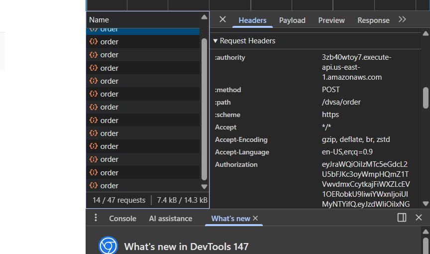

_Figure L2-1: DevTools request showing captured attacker authorization token._

6. Go to jwt.io and paste attacker token.

7. Decode the payload.

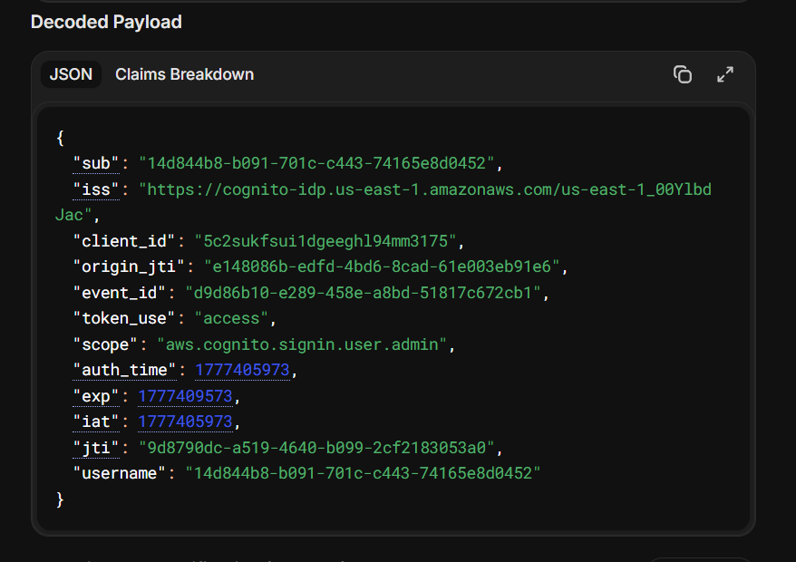

_Figure L2-2: Attacker JWT payload decoded in jwt.io._

8. Login as victim and repeat steps to get victim token.

9. Decode victim token and copy the username.

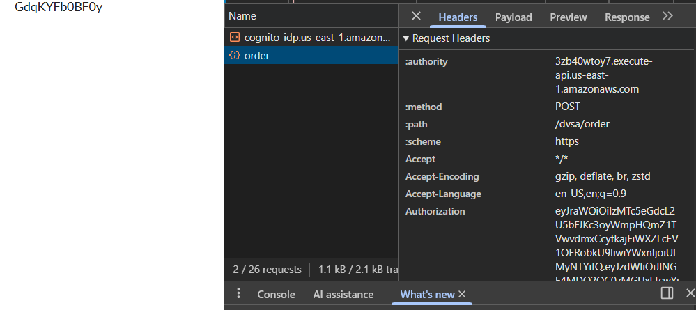

_Figure L2-3: Victim authorization token captured from DevTools._

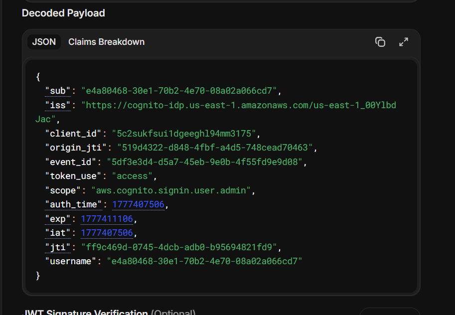

_Figure L2-4: Victim JWT payload decoded in jwt.io._

10. Modify attacker token:

Replace attacker username with victim username

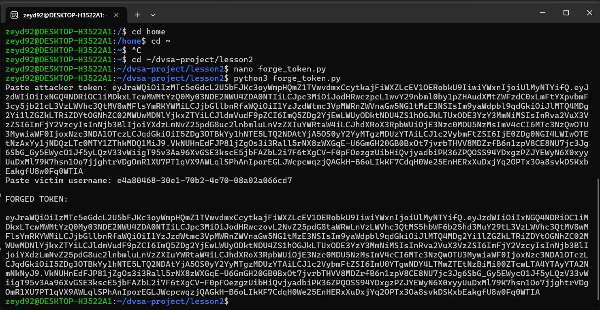

_Figure L2-5: Terminal output showing victim username prepared for token forgery._

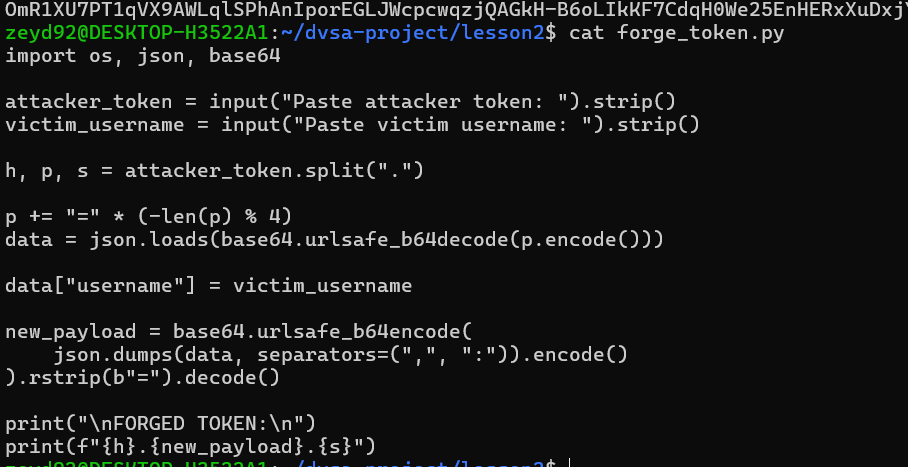

_Figure L2-6: Python script used to forge a modified JWT token._

11. Generate new token (fake token).

12. Send request using curl:

curl -s "$API" \

-H "content-type: application/json" \

-H "authorization: $FAKE" \

-data-raw '{"action":"orders"}' | jq

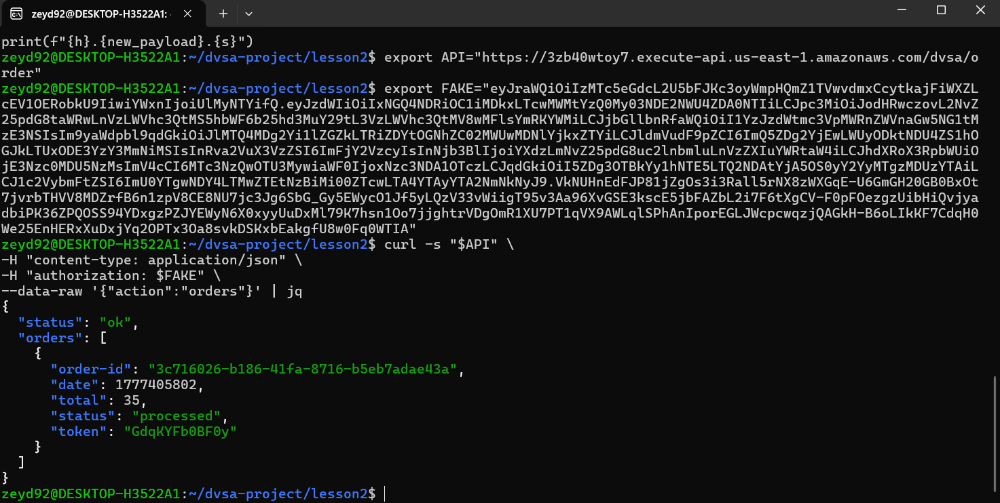

_Figure L2-7: Forged token request returning victim order data._

## Part 5) Evidence and Proof

The obtained response clearly demonstrates that the attacker was able to access data that does not belong to their account. After modifying the JWT payload and replacing the attacker's username with the victim's username, the system accepted the forged token and returned the victim's order information. This confirms that the backend relied solely on the decoded token content without verifying its authenticity. The presence of valid order entries associated with the victim account in the response serves as direct proof that the vulnerability can be successfully exploited to bypass authentication and gain unauthorized access.

## Part 6) Fix Strategy / Probable Mitigation

To mitigate this vulnerability, the authentication mechanism must be strengthened by ensuring that all incoming JWTs are properly verified before any user-related information is extracted. The system should validate the token's signature using the appropriate public keys provided by AWS Cognito, and it must also check critical claims such as issuer and expiration time. By performing full verification, the system can guarantee that the token has not been altered by an attacker. Any request containing an invalid or tampered token should be rejected immediately, preventing unauthorized access to protected resources.

## Part 7) Code / Config Changes

The fix is to properly verify JWT before using it.

Before:

var auth_data = jose.util.base64url.decode(token_sections[1]); var token = JSON.parse(auth_data); var user = token.username;

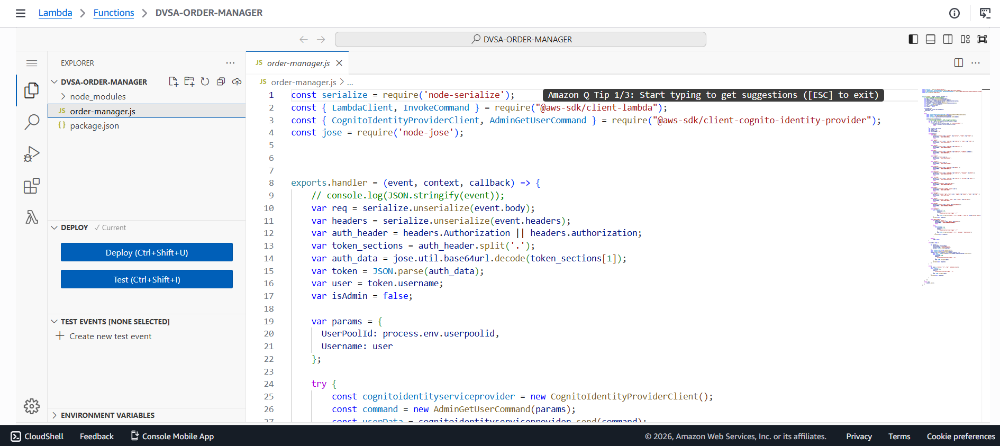

_Figure L2-8: Before - Lambda code decodes JWT without signature verification._

After:

const verified = await verifyCognitoJwt(jwt); if (!verified) { throw new Error("Invalid token"); } var user = verified.username;

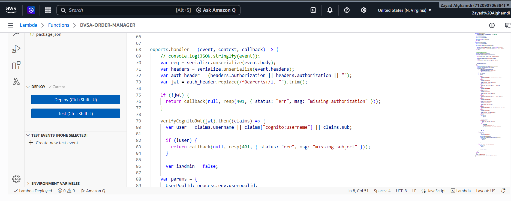

_Figure L2-9: After - JWT verification is added before using token data._

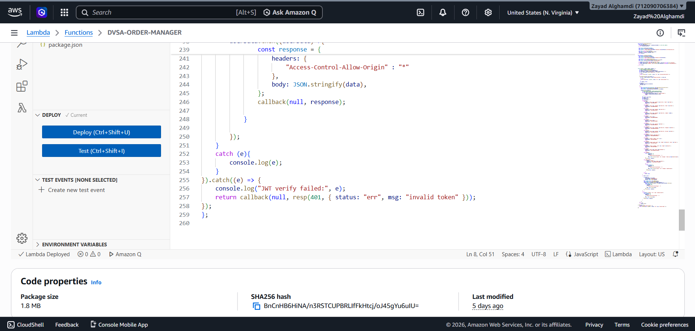

_Figure L2-10: After - invalid token handling is added in the backend._

## Part 8) Verification After Fix

Run same curl command again.

Now result:

{ "status": "err", "msg": "invalid token" }

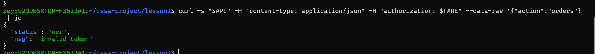

_Figure L2-11: After - attacker trying to get victim orders._

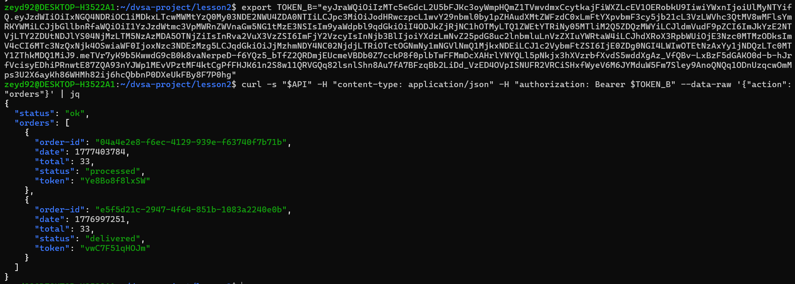

_Figure L2-12: After - attacker getting his own orders._

This confirms that the system now correctly rejects forged tokens while allowing valid tokens to function as expected.

## Part 9) Structured Operation and Security Analysis

The following tables summarize the expected and exploited behaviors before and after applying the fix.

## Table A

| Vulnerability | Intended Rule(s) | Artifacts Used | Normal Behavior | Exploit Behavior |
| --- | --- | --- | --- | --- |
| Broken Authentication | User must access only their data | JWT, API, curl | User sees own orders | Attacker sees victim orders |

## Table B

| Vulnerability | Deviation | Class | Fix Applied | Post-Fix Verification | Optional Latency Before / After Logging |
| --- | --- | --- | --- | --- | --- |
| Broken Authentication | Token trusted without verification | Misuse | Add JWT verification | Attack fails | [Optional timing result] |

## Part 10) Takeaway / Lessons Learned

This vulnerability highlights the importance of not trusting client-controlled data without proper validation. Even though JWTs are commonly used for authentication, they are only secure when their signatures are verified correctly. Simply decoding the token and using its contents without verification exposes the system to serious risks such as identity spoofing and data leakage. In serverless architectures, security checks must always be enforced within backend services, as assumptions about token integrity can lead to critical security failures. Proper implementation of authentication mechanisms is essential to maintain system integrity and protect user data.
