# Lesson #4: Insecure Cloud Configuration

| Field | Value |
| --- | --- |
| Course / Term | ICS344: Information Security / Term 252 |
| Student Name(s) + ID(s) | Hussain Albaggal |
| DVSA Website URL | http://dvsa-website-986263532904-us-east-1.s3-website-us-east-1.amazonaws.com/ |
| AWS Region | us-east-1 (United States, N. Virginia) |
| Lesson Title | Lesson #4: Insecure Cloud Configuration |
| Main AWS Services | Amazon S3, AWS Lambda, CloudWatch Logs, IAM, API Gateway |
| Primary Lambda Function | DVSA-FEEDBACK-UPLOADS |
| CloudWatch Log Group | /aws/lambda/DVSA-FEEDBACK-UPLOADS |
| Feedback S3 Bucket | dvsa-feedback-bucket-986263532904-us-east-1 |

## Part 1) Goal and Vulnerability Summary

Lesson #4 shows an Insecure Cloud Configuration issue in the DVSA feedback upload feature. The main affected parts are the S3 feedback bucket, the S3 event notification connected to the bucket, and the DVSA-FEEDBACK-UPLOADS Lambda function that processes uploaded files.

The problem is that the system allows attacker-controlled file names, or S3 object keys, to reach backend processing. Since the Lambda function used the uploaded object name in an unsafe command operation, a malicious filename could be interpreted as command syntax instead of normal data.

The impact is serious because an attacker can upload a specially named file and cause unintended command execution inside the Lambda environment. At a high level, the vulnerability comes from two weaknesses together: permissive S3 upload configuration and unsafe processing of S3 event data in the backend.

## Part 2) Why This Works / Root Cause

The vulnerability is possible because the feedback upload path allows attacker-controlled file names to become S3 object keys, and the downstream Lambda processing path treats the object key as trusted input. In the vulnerable code, the S3 object key is URL-decoded and inserted into an os.system command. If the filename contains shell metacharacters such as a semicolon, the filename can alter the command executed by the Lambda runtime. The object key should be treated only as untrusted metadata, but the vulnerable behavior lets it become executable shell syntax.

filename = parse.unquote_plus(event["Records"][0]["s3"]["object"]["key"])

os.system("touch /tmp/{} /tmp/{}.txt".format(filename, filename)) # unsafe

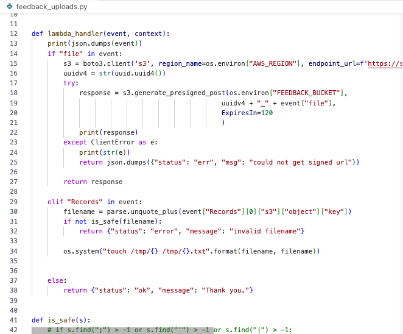

_Figure L4-1: Vulnerable DVSA-FEEDBACK-UPLOADS code before the fix. The S3 object key is decoded and passed into os.system(), enabling command injection through the uploaded filename._

## Part 3) Environment and Setup

| Field | Value |
| --- | --- |
| AWS Region | us-east-1 / N. Virginia |
| DVSA Website | http://dvsa-website-986263532904-us-east-1.s3-website-us-east-1.amazonaws.com/ |
| DVSA API Base | https://s96kq7yks4.execute-api.us-east-1.amazonaws.com/dvsa |
| Workflow | Feedback/contact form file upload |
| Lambda | DVSA-FEEDBACK-UPLOADS |
| Log group | /aws/lambda/DVSA-FEEDBACK-UPLOADS |
| S3 bucket | dvsa-feedback-bucket-986263532904-us-east-1 |
| Tools | AWS Console, DVSA website, CloudWatch Logs, S3 Console, macOS Terminal, curl |

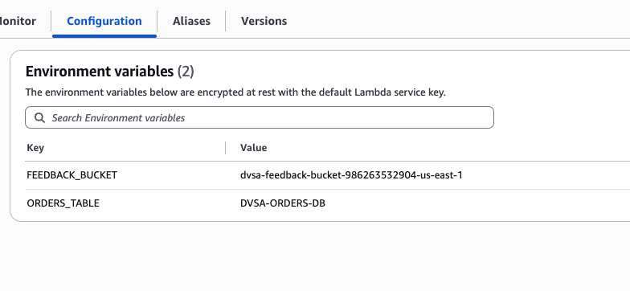

_Figure L4-2: Lambda environment variables showing FEEDBACK_BUCKET = dvsa-feedback-bucket-986263532904-us-east-1 and ORDERS_TABLE = DVSA-ORDERS-DB._

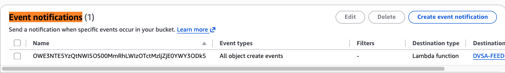

_Figure L4-3: S3 event notification before remediation. All object create events in the feedback bucket invoke a Lambda function, connecting S3 uploads to DVSA-FEEDBACK-UPLOADS processing._

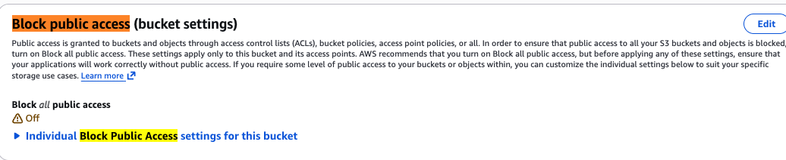

_Figure L4-4: Feedback bucket before remediation with Block all public access turned off._

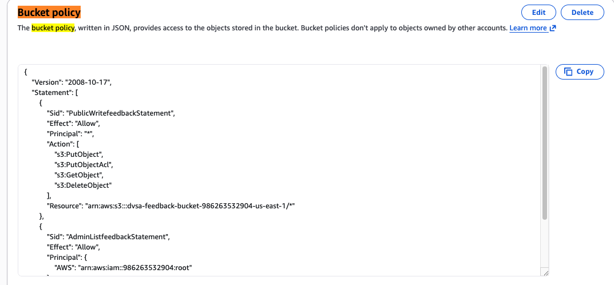

_Figure L4-5: Feedback bucket policy before remediation. Principal "*" was allowed to PutObject, PutObjectAcl, GetObject, and DeleteObject on bucket objects._

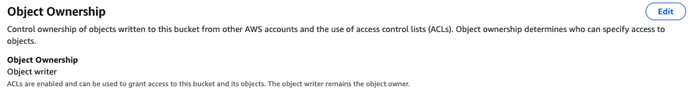

_Figure L4-6: Object Ownership before remediation. The bucket used Object writer ownership and ACLs were enabled._

## Part 4) Reproduction Steps

Confirm that the AWS Console is using the us-east-1 / N. Virginia region.

Identify the affected Lambda function, DVSA-FEEDBACK-UPLOADS, which handles the feedback file upload workflow.

Confirm the feedback bucket used by the function from the FEEDBACK_BUCKET environment variable.

Review the S3 feedback bucket configuration and confirm that object-create events are connected to the feedback upload Lambda function.

Review the bucket permissions and confirm the insecure configuration: Block Public Access was disabled, and the bucket policy allowed public object-level actions.

Prepare a proof-of-concept filename that contains command syntax but only prints a harmless marker:

cat.png; echo ICS344_L4_SUCCESS; #

Submit the file through the normal DVSA feedback form.

Verify that the uploaded object appears in the S3 feedback bucket with the malicious object key preserved.

Check the CloudWatch log group for /aws/lambda/DVSA-FEEDBACK-UPLOADS and search for:

ICS344_L4_SUCCESS

The appearance of ICS344_L4_SUCCESS in CloudWatch confirms that the S3 object key was processed unsafely and reached command execution inside the Lambda environment.

mkdir -p ~/ics344_lesson4

cd ~/ics344_lesson4

touch "cat.png; echo ICS344_L4_SUCCESS; #"

ls -la

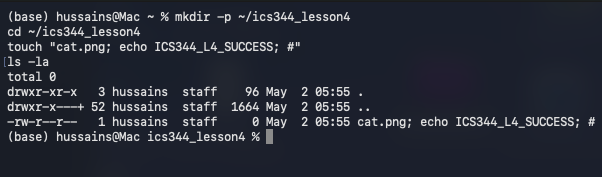

_Figure L4-7: Terminal screenshot showing creation of the benign malicious filename cat.png; echo ICS344_L4_SUCCESS; #._

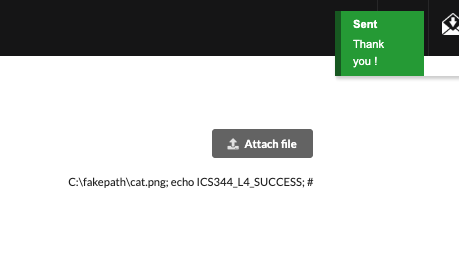

_Figure L4-8: DVSA feedback form accepted the malicious filename and displayed the generic Sent Thank you message before remediation._

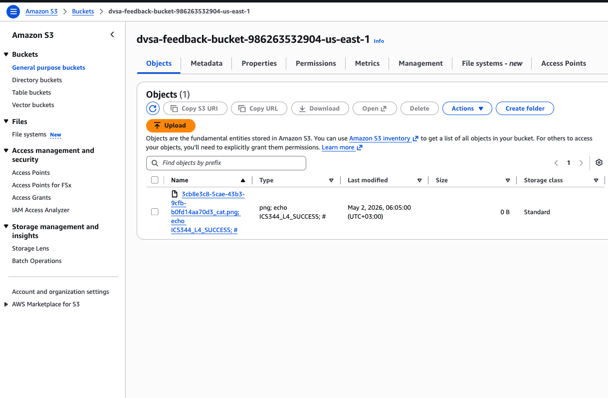

_Figure L4-9: S3 feedback bucket containing the uploaded object key with the malicious command marker preserved in the filename._

## Part 5) Evidence and Proof

The vulnerability is proven by the CloudWatch marker. A normal feedback upload should not print ICS344_L4_SUCCESS. After uploading a file named cat.png; echo ICS344_L4_SUCCESS; #, the marker appeared in CloudWatch Logs for DVSA-FEEDBACK-UPLOADS. This shows that the S3 object key reached shell command processing and that the injected echo command executed in the Lambda runtime.

| Evidence item | What it proves | Screenshot |
| --- | --- | --- |
| Feedback bucket and event notification | Shows uploaded objects can trigger Lambda processing. | Figures L4-2 and L4-3 |
| Bucket policy and public access settings | Shows insecure cloud configuration allowing public object manipulation. | Figures L4-4 and L4-5 |
| Vulnerable Lambda code | Shows S3 object key is inserted into os.system(). | Figure L4-1 |
| Malicious S3 object key | Shows the payload filename was preserved in S3. | Figure L4-9 |
| CloudWatch marker | Shows command execution via ICS344_L4_SUCCESS. | Figure L4-10 |

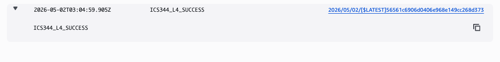

_Figure L4-10: CloudWatch Logs before the fix showing ICS344_L4_SUCCESS. This is the main exploit proof for Lesson 4._

## Part 6) Fix Strategy / Probable Mitigation

The fix should be done in both the Lambda code and the S3 bucket settings. The Lambda must stop using uploaded object names inside shell commands, and it should validate filenames before processing them. The S3 bucket also needs to be hardened by removing public read/write/delete access and enabling stricter access controls. This prevents malicious filenames from executing commands and reduces public S3 misuse.

| Fix layer | Fix | Why it works |
| --- | --- | --- |
| Lambda code | Remove os.system usage with S3 object keys and use safe Python file operations. | Prevents object keys from becoming shell commands. |
| Filename validation | Reject shell metacharacters, path separators, and unsupported characters. | Blocks malicious names such as cat.png; echo ...; #. |
| S3 bucket | Enable Block Public Access and remove public object read/write/delete permissions. | Prevents unintended direct public writes to the bucket. |
| Transport security | Add DenyInsecureTransport bucket policy. | Denies non-HTTPS access. |
| Normal behavior | Allow safe filenames through the intended DVSA feedback workflow. | Preserves legitimate functionality. |

## Part 7) Code / Config Changes

### 7.1 Lambda code before fix

filename = parse.unquote_plus(event["Records"][0]["s3"]["object"]["key"])

if not is_safe(filename):

return {"status": "error", "message": "invalid filename"}

os.system("touch /tmp/{} /tmp/{}.txt".format(filename, filename))

### 7.2 Lambda code after fix

The patched Lambda keeps the same overall structure but adds real filename validation and replaces shell execution with direct Python file operations. The fix rejects unsafe filenames before generating a presigned upload and again before processing S3 Records events.

if "file" in event:

if not is_safe(event["file"]):

return json.dumps({"status": "err", "msg": "invalid filename"})

elif "Records" in event:

filename = parse.unquote_plus(event["Records"][0]["s3"]["object"]["key"])

if not is_safe(filename):

print("Rejected unsafe S3 object key:" + filename)

return {"status": "error", "message": "invalid filename"}

open(os.path.join("/tmp", filename), "a").close()

open(os.path.join("/tmp", filename + ".txt"), "a").close()

print("Processed safe uploaded object:" + filename)

return {"status": "ok", "message": "processed safely"}

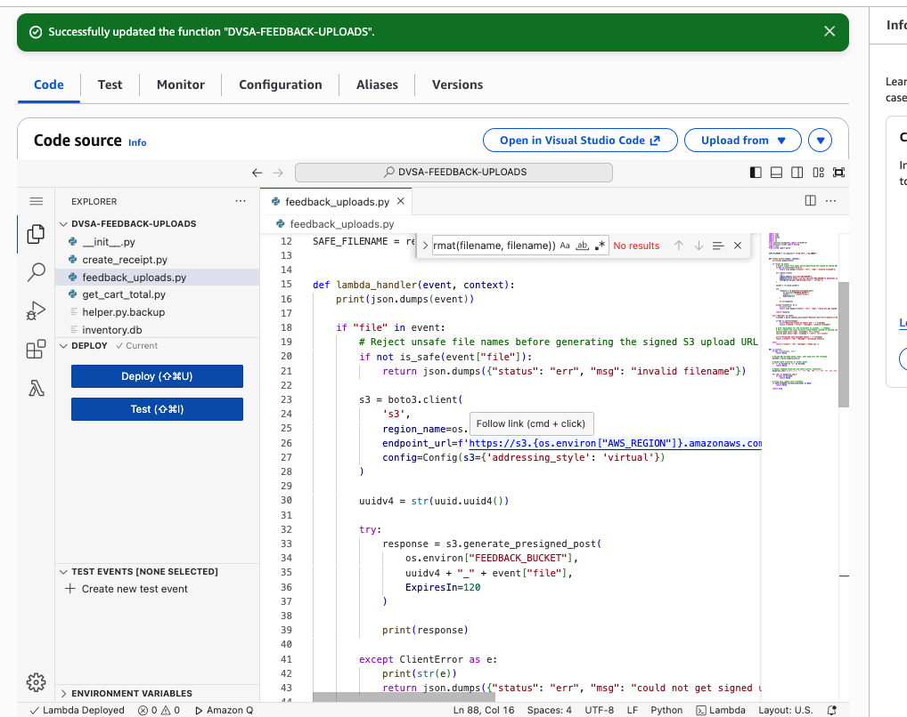

_Figure L4-11: Fixed Lambda code after deployment. Unsafe filenames are rejected before generating a presigned S3 upload URL._

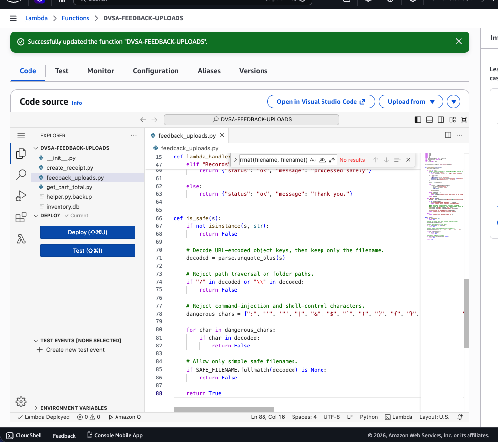

_Figure L4-12: Fixed is_safe() validation logic. Dangerous shell-control characters and path separators are rejected._

### 7.3 S3 bucket hardening after fix

The S3 bucket was hardened by enabling Block all public access and replacing the old public allow policy with a policy that denies insecure non-HTTPS access. The dangerous Principal "*" allow statement for PutObject, PutObjectAcl, GetObject, and DeleteObject was removed.

{

"Version": "2012-10-17",

"Statement": [

{

"Sid": "DenyInsecureTransport",

"Effect": "Deny",

"Principal": "*",

"Action": "s3:*",

"Resource": [

"arn:aws:s3:::dvsa-feedback-bucket-986263532904-us-east-1",

"arn:aws:s3:::dvsa-feedback-bucket-986263532904-us-east-1/*"

],

"Condition": {

"Bool": {

"aws:SecureTransport": "false"

}

}

}

]

}

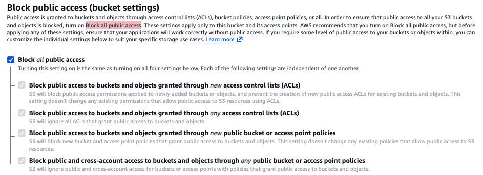

_Figure L4-13: S3 feedback bucket after remediation with Block all public access enabled._

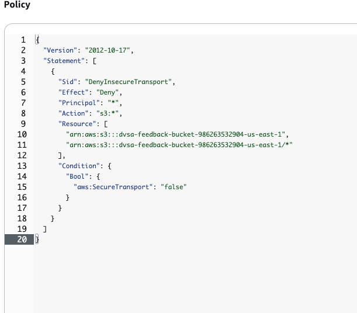

_Figure L4-14: Feedback bucket policy after remediation. The public allow statement was removed and the remaining policy denies insecure transport._

## Part 8) Verification After Fix

After deploying the Lambda fix, the malicious filename was uploaded again. The DVSA frontend still showed its generic success message, but backend verification showed the fix worked: CloudWatch logged that the unsafe S3 object key was rejected, and no new command-output execution marker was produced after the post-fix timestamp.

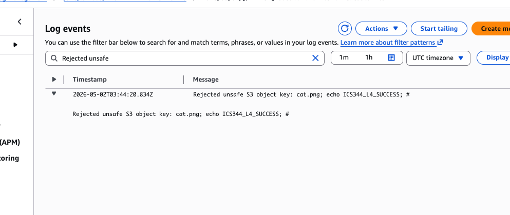

_Figure L4-15: CloudWatch post-fix log showing Rejected unsafe S3 object key: cat.png; echo ICS344_L4_SUCCESS; #._

Normal behavior was then verified using a safe file name. The normal_feedback.txt upload succeeded through the DVSA feedback form, appeared in the S3 bucket, and was processed safely by the Lambda function.

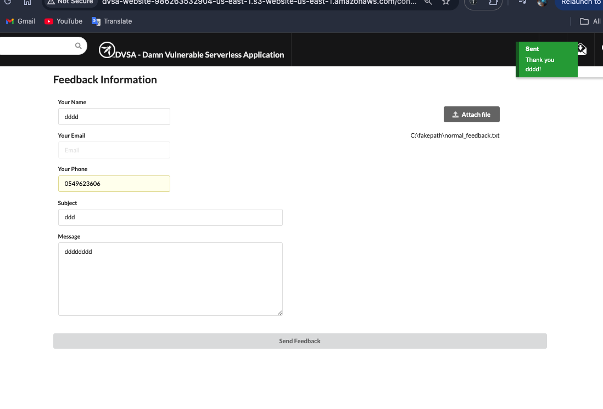

_Figure L4-16: Normal DVSA feedback upload after the code fix using normal_feedback.txt._

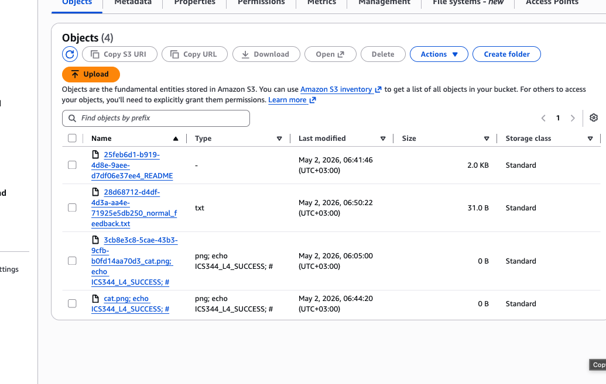

_Figure L4-17: S3 bucket after normal upload. A safe normal_feedback.txt object appears alongside earlier test objects._

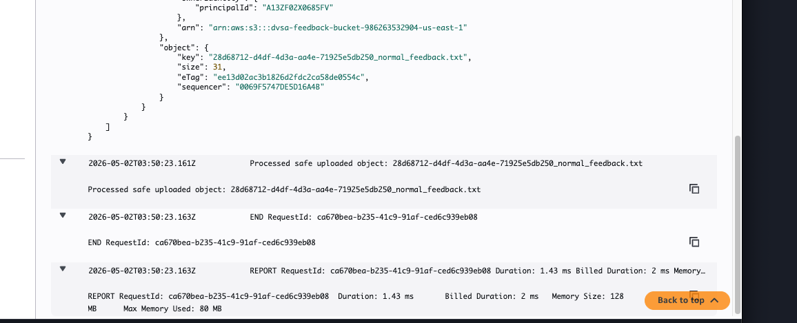

_Figure L4-18: CloudWatch post-fix log showing Processed safe uploaded object for normal_feedback.txt._

The S3 cloud-configuration fix was also verified with an unauthenticated public PUT request. The request returned HTTP 403 AccessDenied, proving that public direct writes to the feedback bucket are no longer allowed. Finally, a normal DVSA feedback upload still worked after the bucket policy hardening.

curl -i -X PUT -data "public write test" "https://dvsa-feedback-bucket-986263532904-us-east-1.s3.us-east-1.amazonaws.com/public-write-test-after-fix.txt"

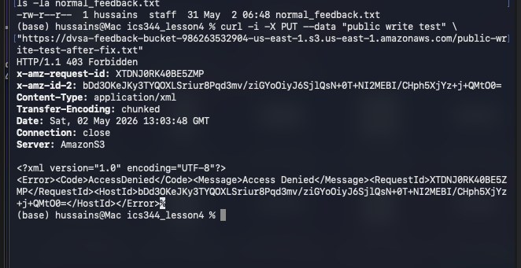

_Figure L4-19: Public unauthenticated PUT request after S3 hardening. The request is denied with HTTP 403 AccessDenied._

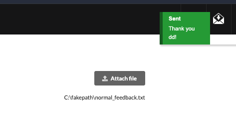

_Figure L4-20: Normal DVSA feedback upload still works after S3 bucket hardening._

## Part 9) Structured Operation and Security Analysis

### 9.1 Intended Logic and Security Rule(s)

Under normal conditions, a logged-in DVSA user submits feedback and optionally attaches a file. The browser requests an upload path, the file is stored in the feedback S3 bucket, and S3 object-create events invoke DVSA-FEEDBACK-UPLOADS. The correct behavior is that the object key is treated only as untrusted metadata, validated, and processed safely without shell execution.

Rule 1: Only the intended application upload flow should write feedback attachments to S3.

Rule 2: S3 object names and event fields are untrusted input.

Rule 3: Object keys must never be concatenated into shell commands.

Rule 4: S3 bucket policies must not allow public object write/read/delete access.

Rule 5: The fix must block malicious names while preserving normal feedback upload.

### 9.2 Evidence Sources and Behavior Trace

| Case | Input / Action | Observed Behavior | Evidence |
| --- | --- | --- | --- |
| Normal intended behavior | Upload normal_feedback.txt through DVSA feedback form. | File accepted and processed safely. | Figures 16, 17, and 18 |
| Exploit behavior | Upload cat.png; echo ICS344_L4_SUCCESS; #. | CloudWatch printed ICS344_L4_SUCCESS before the fix. | Figures 8, 9, and 10 |
| Post-fix behavior | Repeat malicious upload after code fix. | Unsafe object key rejected; no new command execution marker produced. | Figure L4-15 |
| Post-cloud-hardening behavior | Unauthenticated public PUT to S3 bucket. | Request denied with HTTP 403 AccessDenied. | Figure L4-19 |

### 9.3 Deviation Analysis and Classification

The exploit deviates from the intended rule because an S3 object key, which should be metadata, was interpreted as shell command syntax. The CloudWatch ICS344_L4_SUCCESS marker proves the violation because that string was produced by the injected echo command in the filename. The case is classified as Intentional misuse / security-relevant abuse. The permissive bucket policy and Block Public Access setting also represent Accidental misconfiguration because they expanded the ways objects could be written or manipulated in the bucket.

### 9.4 Explainable Fix and Post-Fix Validation

The incorrect assumption was that uploaded S3 object keys could be safely used in backend command processing. The fix belongs in DVSA-FEEDBACK-UPLOADS and in the S3 bucket configuration. The Lambda code now validates filenames and does not call os.system with object keys. The S3 bucket now blocks public access and no longer has a public allow policy for object read/write/delete actions. Post-fix validation showed malicious names are rejected, safe names still process, and public unauthenticated writes are denied.

## Table A - Structured Analysis Summary

| Vulnerability | Intended Rule(s) | Artifacts Used to Infer Rule | Normal Behavior Evidence | Exploit Behavior Evidence |
| --- | --- | --- | --- | --- |
| Lesson #4: Insecure Cloud Configuration | Feedback uploads must use intended paths; S3 object names are data only; Lambda must not execute object keys; the bucket must not allow public object writes/deletes. | DVSA feedback workflow, Lambda code, S3 event notification, bucket policy, Block Public Access setting, S3 objects, terminal output, and CloudWatch logs. | normal_feedback.txt was accepted, appeared in S3, and CloudWatch logged Processed safe uploaded object. | cat.png; echo ICS344_L4_SUCCESS; # appeared in S3, and CloudWatch printed ICS344_L4_SUCCESS before the fix. |

## Table B - Structured Analysis Summary

| Vulnerability | Why This Is a Deviation | Deviation Class | Fix Applied (Where) | Post-Fix Verification | Optional Latency Before / After Logging |
| --- | --- | --- | --- | --- | --- |
| Lesson #4: Insecure Cloud Configuration | An S3 object key was executed as shell syntax instead of treated as data; the bucket also allowed broad public object actions before remediation. | Intentional misuse / security-relevant abuse; plus accidental misconfiguration for public bucket permissions. | DVSA-FEEDBACK-UPLOADS: validate filenames and remove os.system. S3: enable Block Public Access, remove public allow policy, add DenyInsecureTransport. | Malicious key rejected; normal file processed safely; unauthenticated public PUT returned 403 AccessDenied. | N/A |

## Part 10) Takeaway / Lessons Learned

This lesson shows that cloud security problems often appear at the boundary between configuration and code. In a serverless architecture, an uploaded S3 object can automatically trigger Lambda code, so S3 object names, metadata, and event fields must be treated as untrusted input. The main secure design lesson is defense in depth: restrict who can upload to the bucket, validate filenames and file types, avoid shell execution with user-controlled data, and remove public storage permissions that are not required for the application workflow.

## Appendix A - Final Evidence Checklist

| Evidence | Status | Location |
| --- | --- | --- |
| Vulnerable code before fix | Complete | Figure L4-1 |
| Feedback bucket name and environment variables | Complete | Figure L4-2 |
| S3 event notification | Complete | Figure L4-3 |
| S3 bucket permissions before fix | Complete | Figures 4, 5, and 6 |
| Malicious filename and upload | Complete | Figures 7, 8, and 9 |
| CloudWatch exploit proof | Complete | Figure L4-10 |
| Fixed Lambda code | Complete | Figures L4-11 and L4-12 |
| Post-fix malicious rejection | Complete | Figure L4-15 |
| Normal upload verification | Complete | Figures 16, 17, and 18 |
| S3 hardening verification | Complete | Figures 13, 14, 19, and 20 |

## Appendix B - Sources Used

ICS344 Project Description PDF: required 10-part structure, evidence, fix, verification, structured tables, and grading rules.

ICS344 Project Description PDF: Lesson #4 description requiring S3 upload/cloud misconfiguration demonstration, unsafe Lambda processing, and fixes for bucket policy, object-name validation, and command execution.

ICS344 Helper Guide PDF: DVSA deployment and us-east-1 environment guidance.

OWASP DVSA official project repository: https://github.com/OWASP/DVSA
