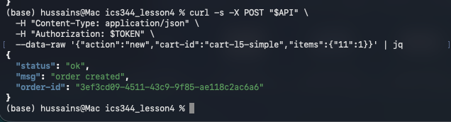
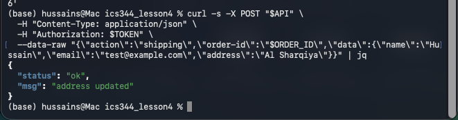
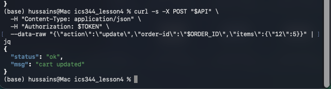
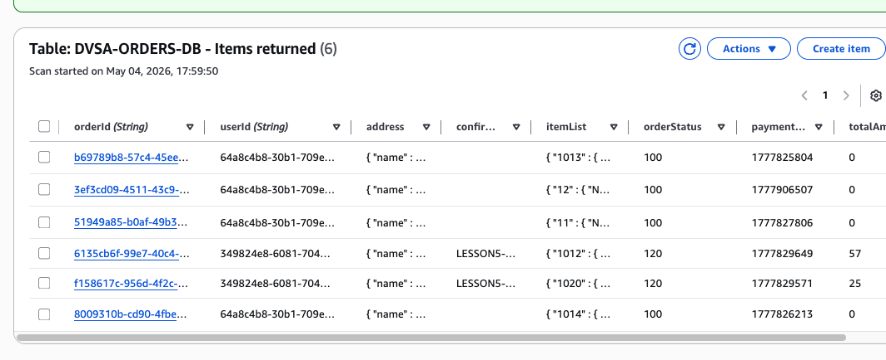
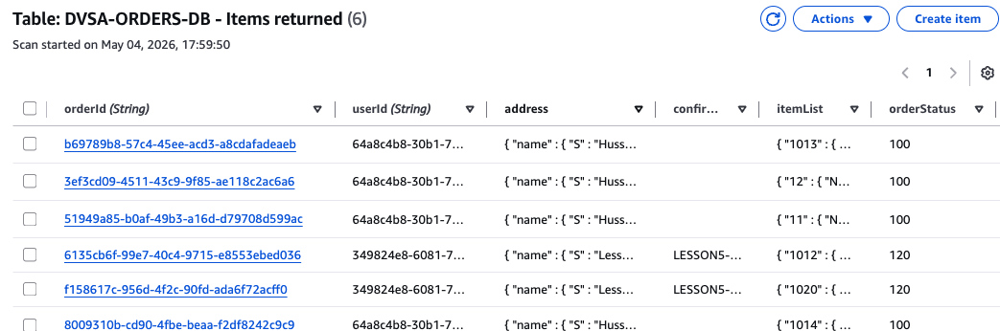
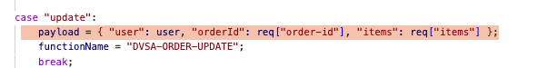
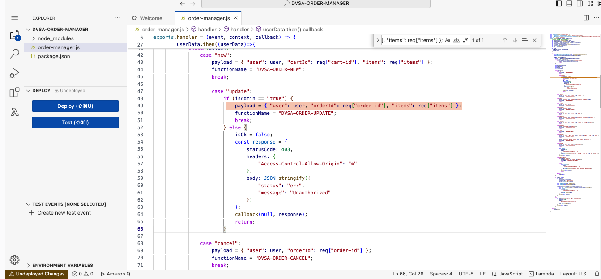
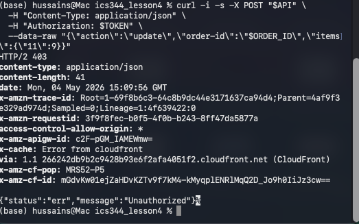
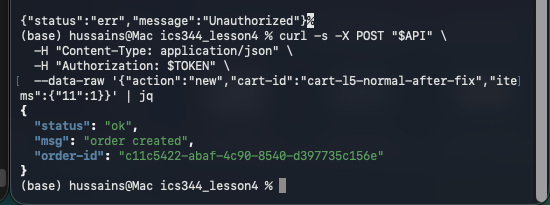

# Lesson #5: Broken Access Control

| Field | Value |
| --- | --- |
| Course / Term | ICS344: Information Security / Term 252 |
| Student | Hussain Albaggal |
| Lesson | Lesson #5: Broken Access Control |
| DVSA Website | http://dvsa-website-986263532904-us-east-1.s3-website-us-east-1.amazonaws.com/ |
| API Endpoint Used | https://s96kq7yks4.execute-api.us-east-1.amazonaws.com/dvsa/order |
| AWS Region | us-east-1 (United States, N. Virginia) |
| Main Components | API Gateway, DVSA-ORDER-MANAGER, DVSA-ORDER-UPDATE, DynamoDB DVSA-ORDERS-DB |
| Main Proof Order ID | 3ef3cd09-4511-43c9-9f85-ae118c2ac6a6 |
| Post-fix Normal Order ID | c11c5422-abaf-4c90-8540-d397735c156e |

## Part 1) Goal and Vulnerability Summary

Lesson #5 demonstrates a Broken Access Control issue in the DVSA order workflow. The affected part is the public /dvsa/order API, which is handled by the DVSA-ORDER-MANAGER Lambda function. This function routes user requests to backend order functions, including the update function.

The problem is that a normal authenticated user can directly call the update action and modify an existing order's stored items. In the test case, the order was changed without admin permission and without completing payment. This is a serious issue because order modification should be controlled by the backend workflow, not by any direct request from a normal user.

At a high level, the weakness is missing server-side authorization for a sensitive order update operation. The system checks that the user is logged in, but it does not properly check whether the user is allowed to perform that update action.

## Part 2) Why This Works / Root Cause

The vulnerability is possible because the backend trusts any authenticated user who sends action="update" to the public order API. Before the fix, the update case in order-manager.js did not check whether the user was an administrator or whether the order was in a state that should allow modification. It simply forwarded the user, order ID, and items to DVSA-ORDER-UPDATE. This violates the rule that privileged or sensitive state-changing actions must be authorized on the backend, not only hidden from the frontend UI.

// Before fix - vulnerable update case case "update": payload = { "user": user, "orderId": req["order-id"], "items": req["items"] }; functionName = "DVSA-ORDER-UPDATE"; break;

## Part 3) Environment and Setup

| Item | Value |
| --- | --- |
| AWS Region | us-east-1 / N. Virginia |
| DVSA Website | http://dvsa-website-986263532904-us-east-1.s3-website-us-east-1.amazonaws.com/ |
| API Endpoint | https://s96kq7yks4.execute-api.us-east-1.amazonaws.com/dvsa/order |
| DynamoDB Table | DVSA-ORDERS-DB |
| Lambda Function Changed | DVSA-ORDER-MANAGER |
| Tools Used | Chrome DevTools, macOS Terminal, curl, jq, AWS Lambda Console, DynamoDB Console |
| Token Handling | Authorization token was used locally but redacted from screenshots/report. |

## Part 4) Reproduction Steps

A normal non-admin DVSA user session was used, and the Authorization token was taken from a browser request to /dvsa/order. The token is not included in the report.

A new order was created through the public /dvsa/order API using cart-id value cart-l5-simple and item 11 with quantity 1.

The API returned the new order ID: 3ef3cd09-4511-43c9-9f85-ae118c2ac6a6

Shipping information was added to the same order using the normal public shipping action.

Without admin privileges and without completing payment, the same normal user sent a direct update request for the same order.

The update request changed the order items from item 11 quantity 1 to item 12 quantity 5.

DynamoDB table DVSA-ORDERS-DB was checked after the request. The order record showed itemList changed to {"12":5}, while orderStatus stayed 100 and totalAmount stayed 0.

This confirmed that the backend allowed a normal authenticated user to modify stored order contents without payment or admin approval.

# Create order as normal user

curl -s -X POST "$API" \ -H "Content-Type: application/json" \ -H "Authorization: $TOKEN" \ --data-raw '{"action":"new","cart-id":"cart-l5-simple","items":{"11":1}}' | jq

Add shipping information

curl -s -X POST "$API" \ -H "Content-Type: application/json" \ -H "Authorization: $TOKEN" \ --data-raw "{\"action\":\"shipping\",\"order-id\":\"$ORDER_ID\",\"data\":{\"name\":\"Hussain\",\"email\":\"test@example.com\",\"address\":\"Al Sharqiya\"}}" | jq

Broken access-control exploit: update without admin/payment

curl -s -X POST "$API" \ -H "Content-Type: application/json" \ -H "Authorization: $TOKEN" \ --data-raw "{\"action\":\"update\",\"order-id\":\"$ORDER_ID\",\"items\":{\"12\":5}}" | jq

_Figure L5-1: A normal user creates a new order through the public /dvsa/order API. The returned order ID is 3ef3cd09-4511-43c9-9f85-ae118c2ac6a6._

_Figure L5-2: Shipping information is added to the newly created order before payment._

_Figure L5-3: The normal user directly calls the update action and receives a successful cart updated response._

## Part 5) Evidence and Proof

The vulnerability is proven by combining the successful update API response with the authoritative DynamoDB record. The public update request returned {"status":"ok","msg":"cart updated"} even though the user was not an administrator and no payment was completed. DynamoDB confirmed that order 3ef3cd09-4511-43c9-9f85-ae118c2ac6a6 was modified to itemList {"12":{"N":"5"}} while orderStatus remained 100 and totalAmount remained 0. This proves broken access control because the backend allowed a regular user to modify stored order contents through an update path that should have been restricted.

| Evidence | What it proves | Screenshot |
| --- | --- | --- |
| Create order response | Shows a normal user can create order 3ef3cd09-4511-43c9-9f85-ae118c2ac6a6 with item 11 quantity 1. | Figure L5-1 |
| Update action response | Shows the same normal user receives cart updated from the public update action. | Figure L5-3 |
| DynamoDB record | Shows stored itemList changed to item 12 quantity 5 while orderStatus stayed 100 and totalAmount stayed 0. | Figure L5-4 |

_Figure L5-4: DynamoDB DVSA-ORDERS-DB after the exploit. The order ID 3ef3cd09-4511-43c9-9f85-ae118c2ac6a6 shows itemList changed to item 12 quantity 5; the order remains unpaid/not completed with orderStatus 100 and totalAmount 0._

_Figure L5-5: Zoomed DynamoDB evidence highlighting the same modified order record._

## Part 6) Fix Strategy / Probable Mitigation

The fix belongs in the backend order manager, not the user interface. The update action must enforce server-side authorization before invoking DVSA-ORDER-UPDATE. In this implementation, the update case was changed so only users whose Cognito custom:is_admin attribute is true can invoke the order update backend function. Non-admin users now receive a 403 Unauthorized response. This addresses the root cause because the sensitive update path is no longer reachable by ordinary authenticated users.

| Fix layer | Purpose |
| --- | --- |
| Backend authorization | Require isAdmin == "true" before executing action update. |
| Fail closed | Return 403 Unauthorized and stop execution for non-admin users. |
| Preserve normal behavior | Keep normal order creation and non-sensitive order workflow actions working. |
| Recommended defense in depth | Also validate order ownership and order state transitions in DVSA-ORDER-UPDATE itself. |

## Part 7) Code / Config Changes

Changed component: AWS Lambda function DVSA-ORDER-MANAGER, source file order-manager.js. The vulnerable update case originally invoked DVSA-ORDER-UPDATE for any authenticated user. The fixed code adds an administrator check and returns 403 Unauthorized for non-admin users.

// Before fix case "update": payload = { "user": user, "orderId": req["order-id"], "items": req["items"] }; functionName = "DVSA-ORDER-UPDATE"; break;

_Figure L5-6: Vulnerable update case before remediation. Any authenticated user could invoke DVSA-ORDER-UPDATE._

// After fix case "update": if (isAdmin == "true") { payload = { "user": user, "orderId": req["order-id"], "items": req["items"] }; functionName = "DVSA-ORDER-UPDATE"; break; } else { isOk = false; const response = { statusCode: 403, headers: { "Access-Control-Allow-Origin": "*" }, body: JSON.stringify({ "status": "err", "message": "Unauthorized" }) }; callback(null, response); return; }

_Figure L5-7: Fixed update case after remediation. The update path now requires isAdmin == true and rejects regular users._

## Part 8) Verification After Fix

After deploying the fixed order-manager.js code, the same update request was repeated as the same regular user. The request was rejected with HTTP 403 and {"status":"err","message":"Unauthorized"}. This confirms that the unauthorized update path was blocked. Normal order creation was then tested after the fix, and the API returned {"status":"ok","msg":"order created"}, proving the fix did not break normal order creation.

# Post-fix unauthorized update attempt

curl -i -s -X POST "$API" \ -H "Content-Type: application/json" \ -H "Authorization: $TOKEN" \ --data-raw "{\"action\":\"update\",\"order-id\":\"$ORDER_ID\",\"items\":{\"11\":9}}"

Normal order creation after fix

curl -s -X POST "$API" \ -H "Content-Type: application/json" \ -H "Authorization: $TOKEN" \ --data-raw '{"action":"new","cart-id":"cart-l5-normal-after-fix","items":{"11":1}}' | jq

_Figure L5-8: Post-fix verification. The same regular user update request is rejected with Unauthorized / HTTP 403._

_Figure L5-9: Normal order creation still works after the access-control fix._

## Part 9) Structured Operation and Security Analysis

### 9.1 Intended Logic and Security Rule(s)

Under normal conditions, a regular DVSA user may create a new order, add shipping data, and proceed through the expected checkout workflow. A regular user should not be able to directly modify stored order contents through a privileged update path after the order is created. Sensitive order modifications must require a verified administrative context or strict server-side workflow validation.

Rule 1: Authentication identifies the user but does not automatically authorize privileged updates.

Rule 2: The update action must be protected by backend authorization checks.

Rule 3: Order state and item changes must be validated server-side, not trusted from arbitrary API requests.

Rule 4: Non-admin users must receive a safe Unauthorized response for privileged update attempts.

Rule 5: Normal order creation should continue working after the fix.

### 9.2 Evidence Sources and Behavior Trace

| Case | Input / Action | Observed Behavior |
| --- | --- | --- |
| Normal behavior | Regular user creates an order with item 11 quantity 1. | API returns order created. |
| Exploit behavior | Same regular user sends action update with item 12 quantity 5. | API returns cart updated; DynamoDB record changes. |
| Post-fix behavior | Same update request repeated after admin check is added. | API returns Unauthorized; normal new order still works. |

### 9.3 Deviation Analysis and Classification

The exploit deviates from the intended rules because a regular authenticated user can directly modify order contents through a backend update path without admin authorization and without payment. The DynamoDB record is the authoritative proof that the backend accepted and persisted the unauthorized change. This is classified as Intentional misuse / security-relevant abuse, because the user intentionally calls a sensitive API action outside the intended workflow.

### 9.4 Explainable Fix and Post-Fix Validation

The incorrect assumption was that any authenticated user could safely access the update route. The fix belongs in DVSA-ORDER-MANAGER, where requests are routed to backend order functions. The update case was changed to require isAdmin == "true" and to return 403 Unauthorized for regular users. Post-fix validation showed that the same request is rejected, while normal order creation still succeeds.

## Table A - Structured Analysis Summary

| Vulnerability | Intended Rule(s) | Artifacts Used to Infer Rule | Normal Behavior Evidence | Exploit Behavior Evidence |
| --- | --- | --- | --- | --- |
| Lesson #5: Broken Access Control | Regular users may create orders, but must not directly perform privileged order updates. | /dvsa/order requests, order-manager.js, DynamoDB DVSA-ORDERS-DB, terminal curl output, AWS Lambda Console. | Normal order creation returned order created before and after the fix. | Update request returned cart updated and DynamoDB showed itemList changed to {"12":5} with orderStatus 100 and totalAmount 0. |

## Table B - Structured Analysis Summary

| Vulnerability | Why This Is a Deviation | Deviation Class | Fix Applied (Where) | Post-Fix Verification | Optional Latency Before / After Logging |
| --- | --- | --- | --- | --- | --- |
| Lesson #5: Broken Access Control | The backend allowed a regular user to update stored order contents without admin privileges or payment. | Intentional misuse / security-relevant abuse | Added admin check to case "update" in DVSA-ORDER-MANAGER/order-manager.js and returned 403 Unauthorized for non-admin users. | Same update request returned Unauthorized; normal order creation still returned order created. | N/A |

## Part 10) Takeaway / Lessons Learned

The main lesson is that authentication is not the same as authorization. A normal user token should allow the user to create and manage only permitted parts of their own order workflow, not perform privileged updates. In serverless applications, every Lambda routing path must enforce authorization on the backend. Hiding an action in the frontend is not enough. Sensitive state-changing operations must check user role, ownership, and order state before modifying DynamoDB.

## Appendix A) Screenshot Index

| Figure | Description |
| --- | --- |
| Figure L5-1 | Create order response as regular user |
| Figure L5-2 | Shipping update response |
| Figure L5-3 | Pre-fix unauthorized update exploit returning cart updated |
| Figure L5-4 | DynamoDB after exploit showing modified itemList |
| Figure L5-5 | DynamoDB zoomed evidence |
| Figure L5-6 | Vulnerable update case before fix |
| Figure L5-7 | Fixed update case after admin check |
| Figure L5-8 | Post-fix update rejected |
| Figure L5-9 | Normal order creation after fix |
