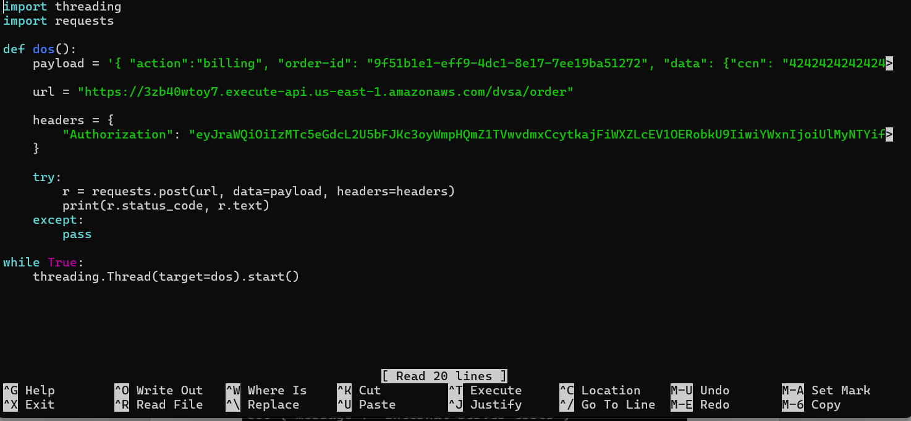
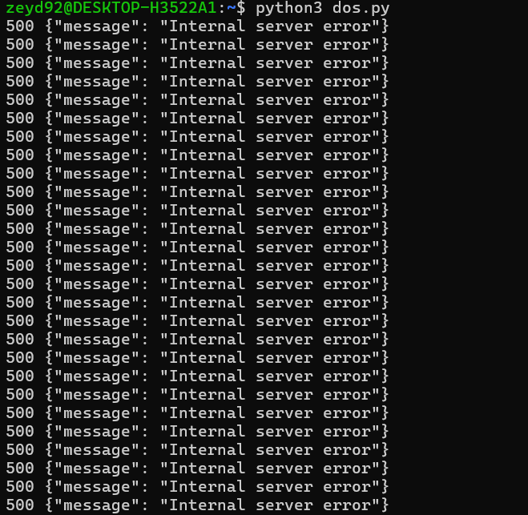
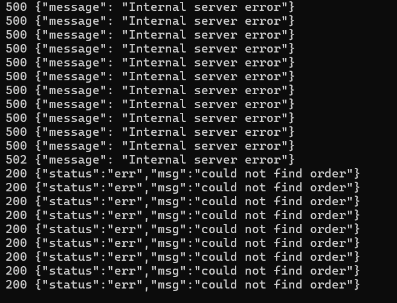
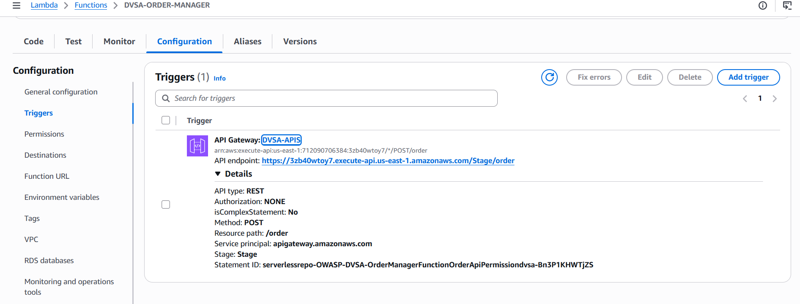
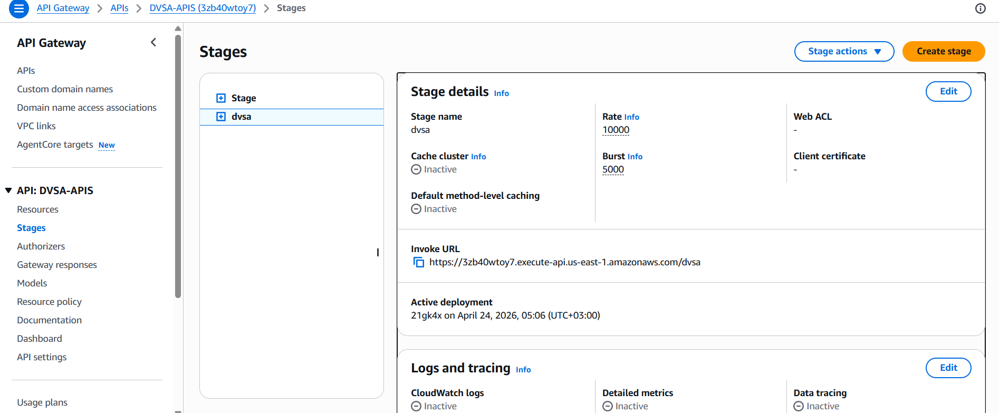
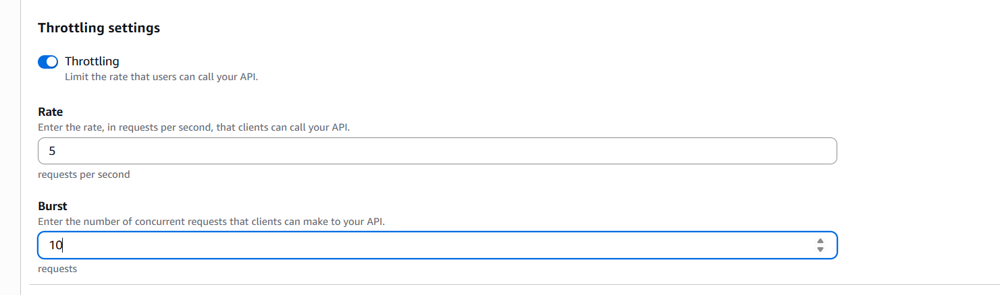
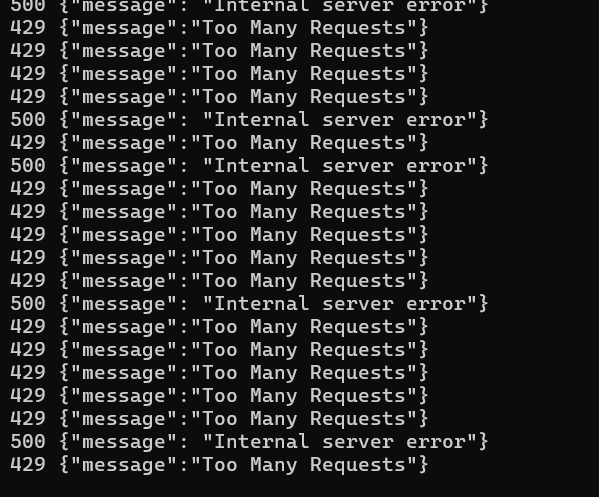

# Lesson #6: Denial of Service (DoS)

| Lesson summary: The system allowed excessive concurrent requests without proper limits. By sending parallel requests, the attacker caused service instability, resulting in errors and degraded performance. |
| --- |

Main affected component: API Gateway throttling, Lambda concurrency, request handling under load

## Part 1) Goal and Vulnerability Summary

This lesson demonstrates a Denial of Service (DoS) vulnerability in the DVSA application.

The system allows multiple concurrent billing requests without proper restriction. An attacker can exploit this by sending many parallel requests, causing the system to become unavailable for legitimate users.

The affected component is the billing API endpoint and its backend Lambda function. The impact is service disruption due to overload.

## Part 2) Why This Works / Root Cause

The vulnerability exists because the system does not properly limit the number of incoming requests.

By sending many requests simultaneously using multiple threads, the attacker overwhelms the backend service. This leads to server errors (500 Internal Server Error), showing that the system cannot handle the load.

The absence of effective rate limiting allows this attack to succeed.

## Part 3) Environment and Setup

The test was performed on the DVSA application deployed on AWS.

Target API:

https://3zb40wtoy7.execute-api.us-east-1.amazonaws.com/dvsa/order

Tools used:

- Python

- requests library

- AWS API Gateway

The attack was implemented using a Python script that sends concurrent requests.

## Part 4) Reproduction Steps

1. A Python script was created to generate multiple concurrent requests.

2. The script continuously sends billing requests to the API.

3. The script was executed using python3 dos.py.

4. The system responses were observed in the terminal.

_Figure L6-1: Python DoS script sending concurrent requests._

## Part 5) Evidence and Proof

The vulnerability was successfully demonstrated.

The system initially processed some requests, but quickly became overwhelmed. This resulted in multiple 500 Internal Server Error responses, indicating that the service was unable to handle the load.

Some requests still returned 200 responses, but many failed due to overload.

_Figure L6-2: Before - repeated 500 errors during concurrent request test._

_Figure L6-3: Before - server overload responses during DoS test._

## Part 6) Fix Strategy / Probable Mitigation

The vulnerability can be mitigated by applying rate limiting at the API Gateway level.

By restricting the number of requests per second, the system can prevent attackers from overwhelming the service.

This ensures that excessive traffic is rejected instead of being processed.

## Part 7) Code / Config Changes

The fix was applied by configuring rate limiting in API Gateway to control incoming traffic and prevent system overload.

The following steps were performed:

Open AWS Console and go to API Gateway.

Select the DVSA API and navigate to the "Stages" section.

_Figure L6-4: API Gateway route connected to the order manager Lambda._

Select the active stage (dvsa) to view its configuration settings.

_Figure L6-5: API Gateway stage selected for throttling configuration._

Enable throttling to limit the number of incoming requests.

Set the rate limit to 5 requests per second to control request frequency.

Set the burst limit to 10 to control short spikes in traffic.

Save the configuration to apply the new rate limiting settings.

_Figure L6-6: After - throttling rate and burst limits configured._

## Part 8) Verification After Fix

After applying rate limiting, the attack was executed again using the same script.

This time, the system did not crash. Instead, it started rejecting excessive requests with 429 Too Many Requests responses.

This confirms that the DoS attack was successfully mitigated.

_Figure L6-7: After - excessive requests rejected with 429 Too Many Requests._

## Part 9) Structured Operation and Security Analysis

The following tables summarize the expected and exploited behaviors before and after applying the fix.

## Table A

| Vulnerability | Intended Rule(s) | Artifacts Used | Normal Behavior | Exploit Behavior |
| --- | --- | --- | --- | --- |
| DoS Attack | System should handle limited traffic | Python, API, requests | Requests processed normally | Server overload (500 errors) |

## Table B

| Vulnerability | Deviation | Class | Fix Applied | Post-Fix Verification | Optional Latency Before / After Logging |
| --- | --- | --- | --- | --- | --- |
| DoS Attack | Excessive requests overwhelm system | Availability | Rate limiting | Requests rejected (429) | Not measured |

## Part 10) Takeaway / Lessons Learned

This lesson demonstrated how a Denial of Service attack can affect system availability.

By sending a large number of concurrent requests, the system became overwhelmed and returned server errors.

After applying rate limiting, the system was able to prevent the attack by rejecting excessive requests.

This highlights the importance of implementing traffic control mechanisms in cloud applications.
