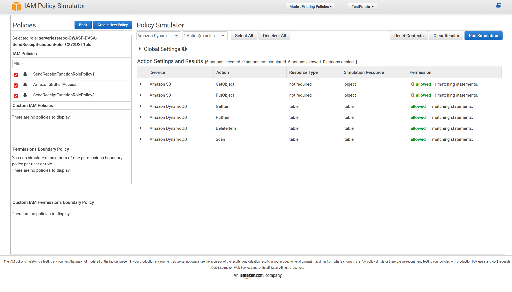

# Lesson #7: Over-Privileged Function

| Lesson summary: The SendReceipt Lambda function had more cloud permissions than its receipt-email task required. The IAM Policy Simulator showed broad S3 and DynamoDB actions allowed, which increases blast radius if the function is abused. |
| --- |

Main affected component: AWS Lambda execution role for DVSA-SEND-RECEIPT-EMAIL, IAM policies, S3, DynamoDB, SES

## Part 1) Goal and Vulnerability Summary

The goal of this lesson is to demonstrate that a Lambda execution role can be over-privileged. The affected component is the IAM policy attached to DVSA-SEND-RECEIPT-EMAIL. The security impact is privilege escalation within the AWS account context: if the function is compromised, an attacker can inherit permissions that are unrelated to sending receipt emails.

## Part 2) Why This Works / Root Cause

The root cause is excessive IAM permissions in the serverless template. The function policy used wildcard-style S3 and DynamoDB CRUD access rather than limiting the role to the receipt bucket and the orders table operations required for its business purpose. This violates the principle of least privilege.

## Part 3) Environment and Setup

DVSA function: DVSA-SEND-RECEIPT-EMAIL

Template/configuration file: template.yml

AWS tools used: IAM Policy Simulator, AWS Console, SAM/CloudFormation template review

Evidence videos: L7Vid_Proof.mp4 and L7Vid_Solution.mp4

## Part 4) Reproduction Steps

Open IAM Policy Simulator and select the execution role attached to DVSA-SEND-RECEIPT-EMAIL.

Select S3 actions such as s3:GetObject and s3:PutObject, then select DynamoDB actions such as dynamodb:GetItem, dynamodb:PutItem, dynamodb:DeleteItem, and dynamodb:Scan.

Run the simulation against wildcard or broad resources.

Confirm that actions unrelated to sending a receipt email are allowed.

Review template.yml and locate the policies that grant broad S3CrudPolicy and DynamoDBCrudPolicy access.

## Part 5) Evidence and Proof

The IAM Policy Simulator output shows that S3 GetObject/PutObject and DynamoDB GetItem/PutItem/DeleteItem/Scan were allowed. These actions are broader than the minimum required for sending a receipt email.

_Figure L7-1: IAM Policy Simulator proof showing unnecessary S3 and DynamoDB permissions allowed for the receipt email role._

## Part 6) Fix Strategy / Probable Mitigation

The fix belongs in the Lambda execution-role policy and the SAM/CloudFormation template. The remediation should remove wildcard resource permissions, scope S3 access to the receipt bucket only, restrict DynamoDB access to the orders table only, and replace full CRUD access with read-only access where the function only needs to read order details.

## Part 7) Code / Config Changes

The vulnerable configuration used wildcard bucket and table values. The corrected configuration narrows S3 and DynamoDB access to the resources used by the receipt-email workflow.

|  |  |
| --- | --- |
| Figure L7-2a: Before - wildcard S3CrudPolicy and DynamoDBCrudPolicy. | Figure L7-2b: After - bucket-scoped S3 policy and read-only orders table policy. |

After: least-privilege policy scope

template.yml - remediation pattern for DVSA-SEND-RECEIPT-EMAIL

Policies: - S3CrudPolicy: BucketName: !Sub dvsa-receipts-bucket-${AWS::AccountId}-${AWS::Region} - DynamoDBReadPolicy: TableName: DVSA-ORDERS-DB - Version: '2012-10-17' Statement: - Effect: Allow Action: - ses:SendEmail - ses:SendRawEmail Resource: '*'

## Part 8) Verification After Fix

After remediation, the IAM Policy Simulator should deny access to unrelated S3 buckets, unrelated DynamoDB tables, DynamoDB DeleteItem, broad Scan where not required, and wildcard resource operations. The function should still be able to send receipts using the configured receipt bucket, the orders table read permission, and SES send permissions. The solution evidence is recorded in L7Vid_Solution.mp4.

## Part 9) Structured Operation and Security Analysis

The following tables summarize the intended behavior, evidence sources, observed deviation, and post-fix validation for this lesson.

## Table A - Intended rule, evidence sources, and observed behavior

| Vulnerability | Intended Rule(s) | Artifacts Used to Infer Rule | Normal Behavior Evidence | Exploit Behavior Evidence |
| --- | --- | --- | --- | --- |
| Lesson #7: Over-Privileged Function | The receipt-email Lambda role must have only the permissions needed to read receipt/order data and send an email. It must not have account-wide S3 or DynamoDB CRUD permissions. | IAM Policy Simulator, template.yml, Lambda function role, proof/solution videos. | A least-privilege role would allow only the receipt bucket, orders table read operations, and SES email actions. | Simulator showed s3:GetObject, s3:PutObject, dynamodb:GetItem, dynamodb:PutItem, dynamodb:DeleteItem, and dynamodb:Scan allowed beyond the function purpose. |

## Table B - Deviation classification, fix, and validation

| Vulnerability | Why This Is a Deviation | Deviation Class | Fix Applied (Where) | Post-Fix Verification | Optional Latency Before / After Logging |
| --- | --- | --- | --- | --- | --- |
| Lesson #7: Over-Privileged Function | The policy allowed cloud actions outside the intended receipt-email workflow, increasing blast radius if the function is compromised. | Accidental misconfiguration / security-relevant abuse potential | template.yml: replace wildcard bucket/table permissions with scoped S3 bucket access and DynamoDBReadPolicy on DVSA-ORDERS-DB. | Re-run simulator: unrelated S3/DynamoDB actions should be denied; legitimate receipt-email behavior remains allowed. | Not measured |

## Part 10) Takeaway / Lessons Learned

Serverless functions inherit their execution-role permissions. Even a small application bug becomes more serious when the function role can access unrelated resources. Least privilege should be enforced at deployment time and verified with policy simulation and CloudTrail-based permission review.
