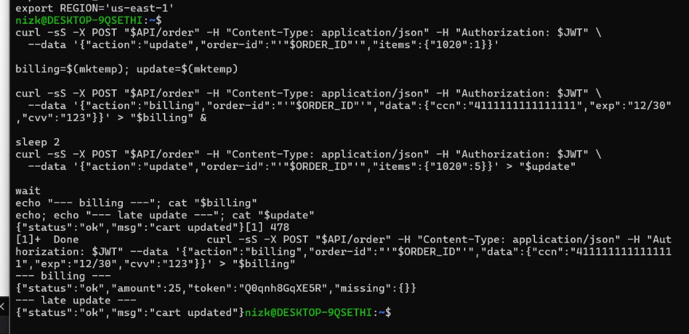
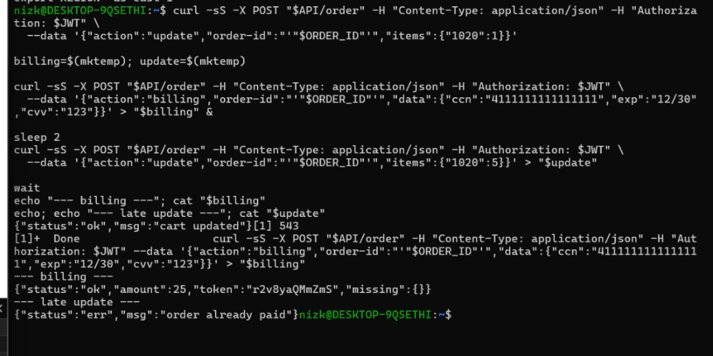

# Lesson #8: Logic Vulnerabilities

| Lesson summary: The checkout process allowed an order to remain mutable while billing was in progress. A late update could change the cart after billing began, so the paid amount and final order contents could become inconsistent. |
| --- |

Main affected component: Order billing workflow, order update workflow, DynamoDB order state, API Gateway/Lambda request sequencing

## Part 1) Goal and Vulnerability Summary

The goal is to demonstrate a business logic race condition in order billing. The affected components are new_order.py, order_billing.py, order update logic, and the DynamoDB order record. The impact is payment integrity failure: the user can be charged for one cart state while the final order records a different item quantity.

## Part 2) Why This Works / Root Cause

The vulnerable code checks orderStatus before billing, but the check is separated from the final DynamoDB update. Billing performs slow external operations after reading the item list. During that window, a second request can update the same order. Because the final write is not conditional, the function can commit payment information based on a stale snapshot.

## Part 3) Environment and Setup

API endpoint: POST $API/order through API Gateway

AWS services: API Gateway, Lambda, DynamoDB, payment/cart processing path

Files involved: new_order.py, order_billing.py, and order update logic

Tools used: browser DevTools, curl, shell background jobs, temporary files, CloudWatch as needed

Evidence videos: L8Vid_proof.mp4, L8Vid_problem1 Order Billing Function.mp4, L8Vid_problem2 Order Update.mp4, L8Vid_Solution.mp4

## Part 4) Reproduction Steps

Create or select an open order and save the order ID from local storage or the API response.

Send an update request that sets the order to a small quantity, such as one unit of item 1020.

Start the billing request in the background with valid billing data.

Wait briefly while the billing request is still processing.

Immediately send a second update request that changes the same order to a larger quantity, such as five units of item 1020.

Compare the billing response with the late update response and the final order state.

Command pattern used to reproduce the timing issue

Race-condition test shape; tokens/endpoints are stored in variables and not printed.

curl -sS -X POST "$API/order" -H "Content-Type: application/json" -H "Authorization: $JWT" -data '{"action":"update","order-id":"'"$ORDER_ID"'","items":{"1020":1}}' billing=$(mktemp); update=$(mktemp) curl -sS -X POST "$API/order" -H "Content-Type: application/json" -H "Authorization: $JWT" -data '{"action":"billing","order-id":"'"$ORDER_ID"'","data":{"ccn":"4111111111111111","exp":"12/30","cvv":"123"}}' > "$billing" & sleep 2 curl -sS -X POST "$API/order" -H "Content-Type: application/json" -H "Authorization: $JWT" -data '{"action":"update","order-id":"'"$ORDER_ID"'","items":{"1020":5}}' > "$update" wait cat "$billing"; cat "$update"

## Part 5) Evidence and Proof

In the vulnerable run, billing returned an amount for the smaller cart while the late update still returned cart updated. This proves that the order remained editable during or immediately after billing, creating a mismatch between payment and final order state. The supplied screenshot is cropped to remove JWT/API setup lines.

_Figure L8-1: Proof of existence - billing completes while the late update still reports cart updated._

## Part 6) Fix Strategy / Probable Mitigation

The fix should enforce workflow state at the database write layer. Billing should atomically move an order from open to billing-in-progress before external calls. Updates should be accepted only while the order is open. Final payment completion should be conditional on the same locked state, so billing and update requests cannot both succeed against conflicting versions of the same order.

## Part 7) Code / Config Changes

Original design issue: mutable itemList stored as live checkout state

new_order.py creates an open/editable order state.

orderId = str(uuid.uuid4()) itemList = event["items"] status = 100 table.put_item( Item={ 'orderId': orderId, 'userId': userId, 'orderStatus': status, 'itemList': itemList, 'totalAmount': 0 } )

Remediation pattern: conditional DynamoDB writes

order_billing.py - lock before payment.

table.update_item( Key=order_key, UpdateExpression='SET orderStatus = :billingStatus', ConditionExpression='orderStatus = :openStatus AND itemList = :currentItems', ExpressionAttributeValues={ ':billingStatus': 115, ':openStatus': 100, ':currentItems': response["Item"]['itemList'] } ) # order_update.py - block late cart updates once billing starts. table.update_item( Key={"orderId": orderId, "userId": userId}, UpdateExpression='SET itemList = :itemList', ConditionExpression='orderStatus = :openStatus', ExpressionAttributeValues={ ':itemList': itemList, ':openStatus': 100 } )

## Part 8) Verification After Fix

After the fix, the same race test was repeated. Billing still completed for the locked order, but the late update was rejected with order already paid. This confirms that the vulnerable behavior no longer succeeds and that the normal billing path remains functional.

_Figure L8-2: Solution verification - the late update is rejected after the order enters a protected state._

## Part 9) Structured Operation and Security Analysis

The following tables summarize the intended behavior, evidence sources, observed deviation, and post-fix validation for this lesson.

## Table A - Intended rule, evidence sources, and observed behavior

| Vulnerability | Intended Rule(s) | Artifacts Used to Infer Rule | Normal Behavior Evidence | Exploit Behavior Evidence |
| --- | --- | --- | --- | --- |
| Lesson #8: Logic Vulnerabilities | After billing begins, the order snapshot used for payment must not be modified. Billing and item updates must be coordinated with atomic state transitions. | Browser workflow, local storage order ID, curl requests, billing/update responses, source code in new_order.py and order_billing.py, proof/solution screenshots. | Open orders can be updated before checkout; billing should lock the order and charge exactly the locked item snapshot. | Billing returned amount 25 while the late update response still reported cart updated, proving conflicting order states could both succeed. |

## Table B - Deviation classification, fix, and validation

| Vulnerability | Why This Is a Deviation | Deviation Class | Fix Applied (Where) | Post-Fix Verification | Optional Latency Before / After Logging |
| --- | --- | --- | --- | --- | --- |
| Lesson #8: Logic Vulnerabilities | The exploit violates payment integrity because the final order state can differ from the state used to calculate payment. | Intentional misuse / security-relevant abuse | order_billing.py and order_update.py: add conditional DynamoDB writes, billing-in-progress state, and update rejection after checkout begins. | Repeated timing test: billing succeeds but late update returns order already paid/rejected; normal checkout remains available. | Not measured |

## Part 10) Takeaway / Lessons Learned

Input validation alone cannot fix a race condition. Serverless workflows that span multiple Lambda invocations and external calls must use atomic state transitions, conditional writes, or idempotency controls so business rules are enforced at commit time.
