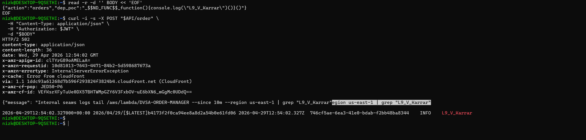
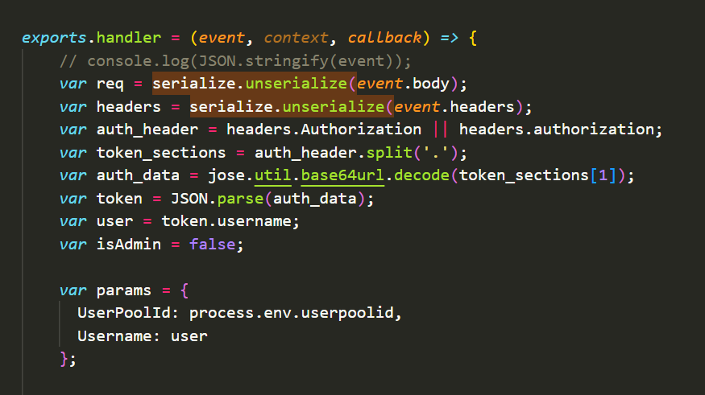

# Lesson #9: Vulnerable Dependencies

| Lesson summary: The order manager used a vulnerable dependency and unsafe deserialization on untrusted request data. A crafted node-serialize payload executed a marker inside the Lambda runtime, proving practical exploitability. |
| --- |

Main affected component: DVSA-ORDER-MANAGER Lambda, order-manager.js, node-serialize package, CloudWatch Logs

## Part 1) Goal and Vulnerability Summary

The goal is to demonstrate that a vulnerable third-party package can become the real entry point for compromise. The affected component is order-manager.js, which used node-serialize to deserialize the request body and headers. The impact is code execution in the Lambda context, followed by any permissions available to that Lambda role.

## Part 2) Why This Works / Root Cause

The root cause is unsafe deserialization of attacker-controlled input. The vulnerable code used serialize.unserialize(event.body) and serialize.unserialize(event.headers). node-serialize function gadgets can be interpreted in a dangerous way, allowing a crafted payload to run code during deserialization.

## Part 3) Environment and Setup

API endpoint: POST $API/order

Lambda function: DVSA-ORDER-MANAGER

Source file: backend/functions/processing/order-manager.js

Verification source: CloudWatch Logs marker string L9_V_Karrar

Tools used: curl, AWS CLI logs tail, CloudWatch Logs

Evidence videos: L9Vid_Proof.mp4 and L9Vid_Solution.mp4

## Part 4) Reproduction Steps

Prepare a JSON payload that contains a node-serialize function gadget and a unique marker string.

Send the payload to POST /dvsa/order using curl and a valid authorization token stored in a shell variable.

Observe that the API may return a generic error such as HTTP 502 because the backend execution path is not client-safe.

Query CloudWatch Logs for the unique marker string.

Confirm that the marker was printed inside the DVSA-ORDER-MANAGER Lambda log stream.

Exploit and verification command pattern

read -r -d '' BODY << 'EOF' {"action":"orders","dep_poc":"_$$ND_FUNC$$_function(){console.log("L9_V_Karrar")}()"} EOF curl -i -s -X POST"$API/order" -H "Content-Type: application/json" -H "Authorization: $JWT" -d "$BODY" aws logs tail /aws/lambda/DVSA-ORDER-MANAGER -since 10m -region us-east-1 | grep "L9_V_Karrar"

## Part 5) Evidence and Proof

The terminal output shows the crafted payload sent to the order endpoint, followed by CloudWatch evidence that the marker L9_V_Karrar executed inside DVSA-ORDER-MANAGER. The setup lines containing the API endpoint and JWT are cropped out.

_Figure L9-1: Proof that the node-serialize gadget marker executed inside the Lambda logs._

_Figure L9-2: Vulnerable order-manager.js code using serialize.unserialize on event.body and event.headers._

## Part 6) Fix Strategy / Probable Mitigation

The fix belongs in order-manager.js and dependency management. The function should not deserialize request data with node-serialize. It should parse JSON using JSON.parse inside a defensive helper, validate the request shape, require a valid Authorization header, and allowlist known actions before invoking downstream Lambda functions. The unsafe dependency should be removed from package.json and replaced with safe standard JSON parsing.

## Part 7) Code / Config Changes

Before

// Before: unsafe deserialization of untrusted input. var req = serialize.unserialize(event.body); var headers = serialize.unserialize(event.headers);

After

// After: safe JSON parsing and authentication guard. function safeParseJson(raw, fallback = {}) { if (!raw) return fallback; if (typeof raw === "object") return raw; try { return JSON.parse(raw); } catch (e) { return fallback; } } function unauthorizedResponse(callback) { callback(null, { statusCode: 401, headers: { "Access-Control-Allow-Origin": "" }, body: JSON.stringify({ "status": "err", "message": "Unauthorized" }) }); } exports.handler = (event, context, callback) => { var req = safeParseJson(event.body, {}); var headers = safeParseJson(event.headers, {}); var auth_header = headers.Authorization || headers.authorization; if (!auth_header) return unauthorizedResponse(callback); var action = req.action; switch (action) { case "new": case "update": case "cancel": case "get": case "orders": case "billing": // invoke the approved downstream function for this action break; default: callback(null, { statusCode: 200, headers: { "Access-Control-Allow-Origin": "" }, body: JSON.stringify({"status":"err", "msg":"unknown action"}) }); } };

## Part 8) Verification After Fix

The exploit payload should no longer execute because the request body is parsed as JSON data instead of being interpreted by node-serialize. Replaying the same payload should either be rejected as an unknown or invalid action, or processed only as inert data. CloudWatch should contain no new L9_V_Karrar execution marker after the fix. The post-fix demonstration is documented in L9Vid_Solution.mp4.

## Part 9) Structured Operation and Security Analysis

The following tables summarize the intended behavior, evidence sources, observed deviation, and post-fix validation for this lesson.

## Table A - Intended rule, evidence sources, and observed behavior

| Vulnerability | Intended Rule(s) | Artifacts Used to Infer Rule | Normal Behavior Evidence | Exploit Behavior Evidence |
| --- | --- | --- | --- | --- |
| Lesson #9: Vulnerable Dependencies | Request bodies and headers must be treated as data. The order manager must not deserialize untrusted input with a package that can interpret executable function payloads. | order-manager.js, package dependency, curl payload, API response, CloudWatch logs, proof/solution videos. | A valid request is parsed as JSON, mapped to an allowlisted action, and routed to the correct downstream Lambda. | Crafted node-serialize payload printed L9_V_Karrar inside DVSA-ORDER-MANAGER CloudWatch logs. |

## Table B - Deviation classification, fix, and validation

| Vulnerability | Why This Is a Deviation | Deviation Class | Fix Applied (Where) | Post-Fix Verification | Optional Latency Before / After Logging |
| --- | --- | --- | --- | --- | --- |
| Lesson #9: Vulnerable Dependencies | The request body was treated as executable content, violating the rule that untrusted client input must remain data only. | Intentional misuse / security-relevant abuse | order-manager.js and package dependencies: remove node-serialize usage; implement safeParseJson, authorization checks, and action allowlisting. | Replay gadget payload; no marker appears in CloudWatch and request is handled as inert data or rejected. | Not measured |

## Part 10) Takeaway / Lessons Learned

Dependency risk is application risk. In serverless systems, a vulnerable package inside a Lambda deployment can directly expose the Lambda runtime and its IAM role. Avoid unsafe deserialization, keep dependency inventories small, and scan/pin packages during deployment.
