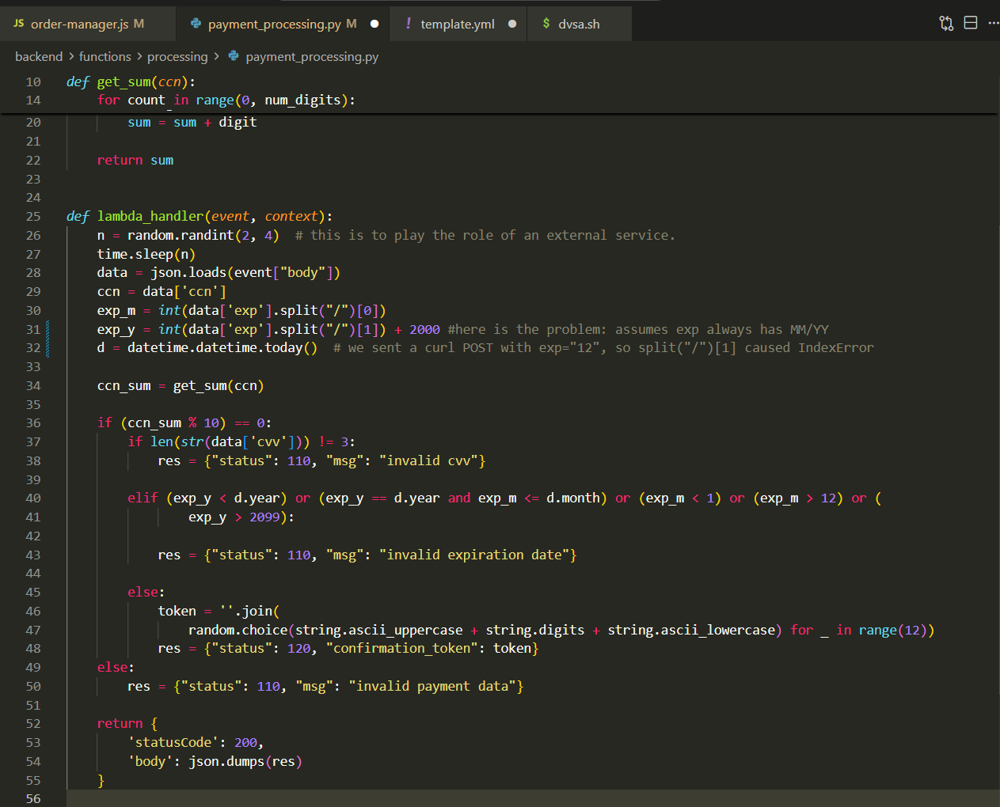
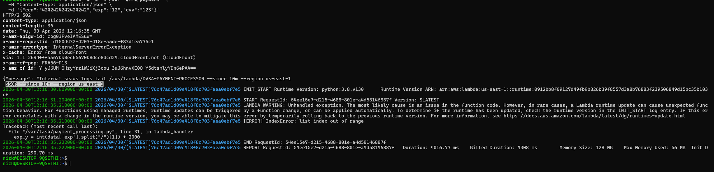
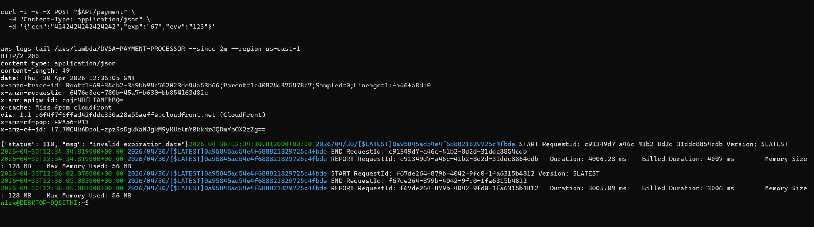

# Lesson #10: Unhandled Exceptions

| Lesson summary: Malformed payment input caused an uncaught Python exception in the payment processor. Instead of returning a controlled validation error, the backend crashed and produced internal error evidence in API/CloudWatch output. |
| --- |

Main affected component: DVSA-PAYMENT-PROCESSOR Lambda, payment_processing.py, API Gateway error handling, CloudWatch Logs

## Part 1) Goal and Vulnerability Summary

The goal is to show that malformed input can trigger unhandled exceptions in backend Lambda code. The affected component is payment_processing.py in DVSA-PAYMENT-PROCESSOR. The impact is availability and information disclosure: malformed requests produce backend failure and logs reveal the crash location and exception type.

## Part 2) Why This Works / Root Cause

The root cause is unsafe parsing and missing validation. The original code assumed that exp always had the MM/YY format and directly accessed data["exp"].split("/")[1]. When exp is malformed, the list index does not exist and Python raises IndexError instead of returning a controlled error response.

## Part 3) Environment and Setup

API endpoint: POST $API/payment

Lambda function: DVSA-PAYMENT-PROCESSOR

Source file: backend/functions/processing/payment_processing.py

Verification source: CloudWatch Logs traceback and post-fix normal invocation logs

Tools used: curl, AWS CLI logs tail, CloudWatch Logs

Evidence videos: L10Vid_Proof.mp4 and L10Vid_Solution.mp4

## Part 4) Reproduction Steps

Send a payment request with valid-looking ccn and cvv values but a malformed expiration value, such as exp set to 12 instead of MM/YY.

Observe the API response. The vulnerable behavior returns a backend failure such as HTTP 502/InternalServerErrorException.

Tail the DVSA-PAYMENT-PROCESSOR CloudWatch log stream.

Confirm that the logs contain LAMBDA_WARNING: Unhandled exception and a Python traceback pointing to payment_processing.py at the expiration parsing line.

Malformed payment request used for proof

curl -i -s -X POST "$API/payment" -H "Content-Type: application/json" -d '{"ccn":"4242424242424242","exp":"12","cvv":"123"}' aws logs tail /aws/lambda/DVSA-PAYMENT-PROCESSOR -since 10m -region us-east-1

## Part 5) Evidence and Proof

The vulnerable code directly accesses split("/")[1], and the proof output shows an IndexError traceback in CloudWatch after a malformed exp value. Setup lines containing API/JWT values are cropped out of the terminal evidence.

_Figure L10-1: Vulnerable expiration parsing in payment_processing.py assumes exp has MM/YY format._

_Figure L10-2: Proof of exploitation - malformed exp causes HTTP 502 and CloudWatch IndexError traceback._

## Part 6) Fix Strategy / Probable Mitigation

The fix belongs in payment_processing.py. The function should parse JSON safely, validate that the request body is an object, verify that ccn and cvv contain expected digits, verify that exp has exactly two slash-separated parts, and catch conversion errors before using expiration values in date comparisons. Client responses should be controlled and generic; detailed diagnostics should remain in CloudWatch only.

## Part 7) Code / Config Changes

Before

Before: crash-prone parsing.

data = json.loads(event["body"]) ccn = data['ccn'] exp_m = int(data['exp'].split("/")[0]) exp_y = int(data['exp'].split("/")[1]) + 2000

After

After: defensive request parsing and expiration validation.

try: raw_body = event.get("body", "{}") data = json.loads(raw_body) if isinstance(raw_body, str) else raw_body except Exception: return {'statusCode': 400, 'body': json.dumps({"status": 110, "msg": "invalid request format"})} if not isinstance(data, dict): return {'statusCode': 400, 'body': json.dumps({"status": 110, "msg": "invalid request format"})} ccn = str(data.get('ccn', "")) exp = str(data.get('exp',"")) cvv = str(data.get('cvv',"")) if not ccn.isdigit(): return {'statusCode': 200, 'body': json.dumps({"status": 110, "msg": "invalid payment data"})} exp_parts = exp.split("/") if len(exp_parts) != 2: return {'statusCode': 200, 'body': json.dumps({"status": 110, "msg": "invalid expiration date"})} try: exp_m = int(exp_parts[0]) exp_y = int(exp_parts[1]) + 2000 except ValueError: return {'statusCode': 200, 'body': json.dumps({"status": 110, "msg": "invalid expiration date"})}

## Part 8) Verification After Fix

After the fix, the same malformed expiration request returns a controlled response such as invalid expiration date. The CloudWatch log shows normal START/END/REPORT records without an unhandled-exception traceback for the malformed input case.

_Figure L10-3: Post-fix verification - malformed exp is rejected safely and logs do not show a traceback._

## Part 9) Structured Operation and Security Analysis

The following tables summarize the intended behavior, evidence sources, observed deviation, and post-fix validation for this lesson.

## Table A - Intended rule, evidence sources, and observed behavior

| Vulnerability | Intended Rule(s) | Artifacts Used to Infer Rule | Normal Behavior Evidence | Exploit Behavior Evidence |
| --- | --- | --- | --- | --- |
| Lesson #10: Unhandled Exceptions | Malformed client input must be rejected through controlled validation paths. Backend code must not assume request fields are present or correctly formatted. | payment_processing.py, curl malformed request, API response, CloudWatch traceback, post-fix logs, proof/solution videos. | Valid payment data is processed; invalid payment data returns an application-level error without crashing the Lambda. | Request with exp="12" returned HTTP 502 and CloudWatch showed IndexError at payment_processing.py expiration parsing. |

## Table B - Deviation classification, fix, and validation

| Vulnerability | Why This Is a Deviation | Deviation Class | Fix Applied (Where) | Post-Fix Verification | Optional Latency Before / After Logging |
| --- | --- | --- | --- | --- | --- |
| Lesson #10: Unhandled Exceptions | The function allowed malformed input to reach crash-prone parsing and exposed internal failure details through logs/API behavior. | Intentional misuse / security-relevant abuse | payment_processing.py: add safe JSON parsing, type checks, field validation, guarded expiration split, and ValueError handling. | Replay malformed request; response is invalid expiration date/invalid request format and CloudWatch has no unhandled exception traceback. | Not measured |

## Part 10) Takeaway / Lessons Learned

Unhandled exceptions are both reliability and security problems. In serverless applications, a single malformed request can produce noisy failures, leak implementation details, and hide the real problem behind API Gateway 502 errors. Defensive validation and centralized error handling keep backend failures controlled.

Evidence Inventory and Final Notes

The following named video files were referenced by the source work and should be submitted alongside the report if the course deliverables require demo recordings.

Video evidence inventory

| Lesson | Proof / Problem Explanation | Solution / Verification |
| --- | --- | --- |
| Lesson 7 | L7Vid_Proof.mp4 | L7Vid_Solution.mp4 |
| Lesson 8 | L8Vid_proof.mp4; L8Vid_problem1 Order Billing Function.mp4; L8Vid_problem2 Order Update.mp4 | L8Vid_Solution.mp4 |
| Lesson 9 | L9Vid_Proof.mp4 | L9Vid_Solution.mp4 |
| Lesson 10 | L10Vid_Proof.mp4 | L10Vid_Solution.mp4 |

| Submission checklist: Before final submission, fill in the cover-page student details and confirm that every screenshot remains redacted. Do not include raw JWTs, AWS credentials, session tokens, or valid API secrets in the submitted copy. |
| --- |
